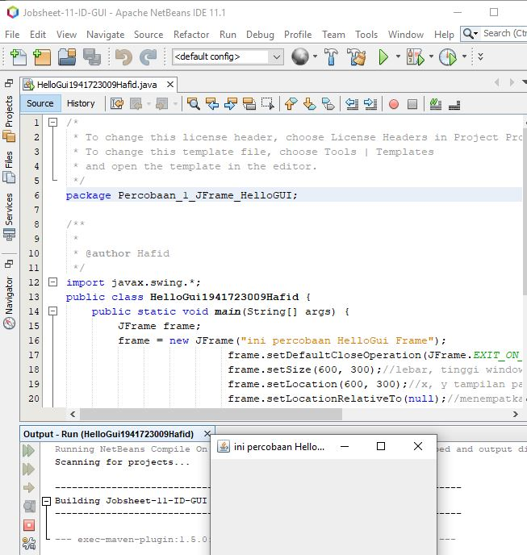
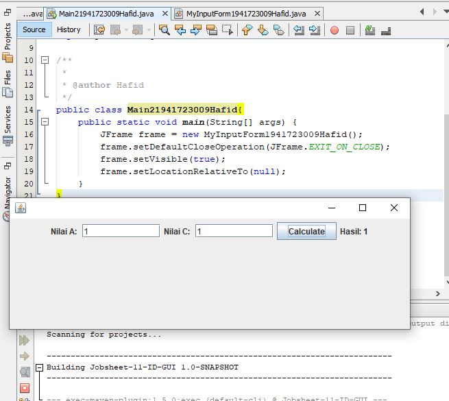
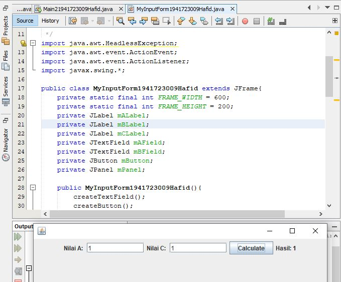

# Laporan #11 - Pengantar Konsep PBO

# GUI(Graphical User Interface)

## Kompetensi

Setelah menyelesaikan lembar kerja ini mahasiswa diharapkan mampu:
1. Membuat aplikasi Graphical User Interface sederhana dengan bahasa pemrograman java;
2. Mengenal komponen GUI seperti frame, label, textfield, combobox, radiobutton, checkbox,
textarea, menu, serta table;
3. Menambahkan event handling pada aplikasi GUI  
## Ringkasan Materi
 GUI adalah sebuah interface antara user dengan program dengan tampilan grafis.
 Bagian dalam GUI ada 4 :
1. Membuat windows utama
2. Menentukan komponen-komponen pendukung program
3. Menentukan tata letak layout agar nantinya semua komponen – komponen yang sudah
dipersiapkan bisa diaatur sedemikian rupa
4. Event Handling dari sebuah aktivitas, seperti penekanan button, check box dan lain-lain,
Java Swing merupakan bagian dari JFC (Java Foundation Classes) yang menyediakan API untuk
menangani hal yang berkaitan dengan GUI bagi program Java. Kita bisa membedakan komponen
Swing dengan komponen AWT, di mana pada umumnya kelas-kelas yang berada dalam komponen
Swing diawali dengan huruf J, misal: JButton, JLabel, JTextField, JRadioButton.

## Percobaan

### Percobaan 1

1. Percobaan pada JFrame HelloGUI

link kode program : [link kode](../../src/11_GUI/HelloGui1941723009Hafid.java)

### Percobaan 2 

1. Percobaan pada input pada GUI

link kode program : [link kode](../../src/11_GUI/Main21941723009Hafid.java)

link kode program : [link kode](../../src/11_GUI/MyInputForm1941723009Hafid.java)

### Pertanyaan

Modifikasi kode program dengan menambahkan JButton baru untuk melakukan fungsi
perhitungan penambahan, sehingga ketika button di klik (event click) maka akan
menampilkan hasil penambahan dari nilai A dan B

### Percobaan 3

1. Percobaan pada Manajemen Layout

link kode program : [link kode](../../src/11_GUI/Border1941723009Hafid.java)

link kode program : [link kode](../../src/11_GUI/Grid1941723009Hafid.java)

link kode program : [link kode](../../src/11_GUI/Box1941723009Hafid.java)

link kode program : [link kode](../../src/11_GUI/Main31941723009Hafid.java)

### Pertanyaan

a) Apa perbedaan dari Grid Layout, Box Layout dan Border Layout?
b) Apakah fungsi dari masing-masing kode berikut?
### Percobaan 4

1. Percobaan pada class Owner

link kode program : [link kode](../../src/9_Owner1941723009Hafid.java)

2. Percobaan pada class Tester4

link kode program : [link kode](../../src/9_Tester41941723009Hafid.java)

3. Hasil Output

link kode program : [link kode](../../src/9_Tester41941723009Hafid.java)

### Pertanyaan

1. Perhatikan class Tester4 baris ke-7 dan baris ke-11, mengapa
pemanggilan ow.pay(eBill) dan ow.pay(pEmp) bisa dilakukan,
padahal jika diperhatikan method pay() yang ada di dalam class
Owner memiliki argument/parameter bertipe Payable? Jika
diperhatikan lebih detil eBill merupakan objek dariElectricityBill dan pEmp merupakan objek dari
PermanentEmployee?
jawab : 
diperlukan fungsi if dan instanceof untuk mengambil suatu nilai dari 2 Class yang berbeda
2. Jadi apakah tujuan membuat argument bertipe Payable pada method pay() yang ada di dalam class Owner?
jawab :
tujuannya adalah untuk membedakan subClass yang di extends dari Class parent
3. Coba pada baris terakhir method main() yang ada di dalam class Tester4 ditambahkan perintah ow.pay(iEmp); Mengapa terjadi error?
jawab :
Karena Class interface Payable bukan Parent dari Class InternshipEmployee 
4. Perhatikan class Owner, diperlukan untuk apakah sintaks p
instanceof ElectricityBill pada baris ke-6 ?
jawab :
sintaks tersebut untuk mengecek apakah Class ElectricityBill adalah Class turunannya / implementnya Class Interface Payable
5. Perhatikan kembali class Owner baris ke-7, untuk apakah casting
objek disana (ElectricityBill eb = (ElectricityBill) p)
diperlukan ? Mengapa objek p yang bertipe Payable harus di-casting
ke dalam objek eb yang bertipe ElectricityBill ?

Karena untuk mengecek instanceof parent dan subclassnya dengan cara menghubungkan class parent dan subclassnya sehingga class parent berubah menjadi subclassnya apabila berhasil di ganti maka hasil output dari subclassnya akan muncul.

### Tugas

1. Percobaan pada class maintugas

link kode program : [link kode](../../src/9_TesterTugas1941723009Hafid.java)

2. hasil Output

## Kesimpulan

saya mempelajari konsep PBO salah satu 4 pilar yaitu Polimorfisme yang berartikan perubahan bentuk maksutnya Class parent Berubah bentuk menjadi Class turunannya dengan cara membuat objek dan memanggil method didalam Class parent yang mengoverriding ke Class turunannya.

## Pernyataan Diri

	Saya menyatakan isi tugas, kode program, dan laporan praktikum ini dibuat oleh saya sendiri. Saya tidak melakukan plagiasi, kecurangan, menyalin/menggandakan milik orang lain.

	Jika saya melakukan plagiasi, kecurangan, atau melanggar hak kekayaan intelektual, saya siap untuk mendapat sanksi atau hukuman sesuai peraturan perundang-undangan yang berlaku.

	Ttd,

	(Hafid Ali Rahman Wibisana)