# Laporan #12 - Pengantar Konsep PBO

# Java_API_dan_Database

## Kompetensi

Setelah menempuh materi percobaan ini, mahasiswa mampu mengenal:
1. Menggunakan paradigma berorientasi objek untuk interaksi dengan database
2. Membuat backend dan frontend
3. Membuat form sebagai frontend  

## Ringkasan Materi

Secara umum, tahapan yang akan kita lakukan adalah sebagai berikut:
1. Membuat database dan tabel-tabelnya.
2. Membuat backend yang berisi class-class yang mewakili data yang ada pada database, dan
class helper untuk melakukan eksekusi query database.
3. Membuat frontend yang merupakan antarmuka kepada pengguna. Frontend ini bisa
berbasis teks (console), GUI, web, mobile, dan sebagainya.
Library yang digunakan untuk project ini antara lain:
1. JDBC, untuk melakukan interaksi ke database.
2. ArrayList, untuk menampung data hasil query ke database.
3. Swing, untuk membuat tampilan GUI.

## Percobaan

### Percobaan 1

1. Datebase perpustakaan

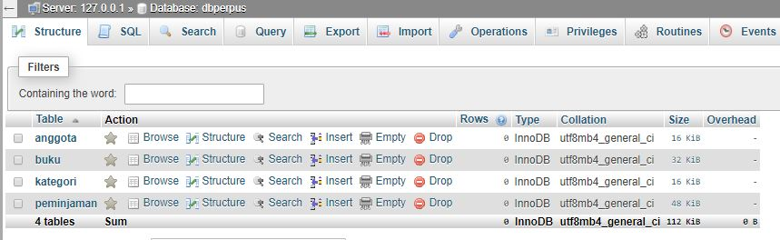

2. Table Anggota

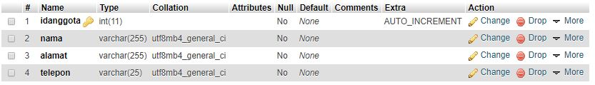

3. Tabel Buku

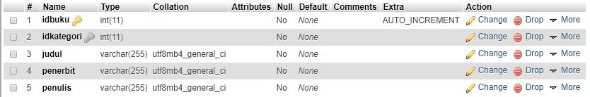

4. Tabel Kategori

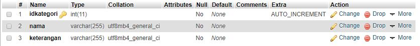

5. Tabel Peminjaman

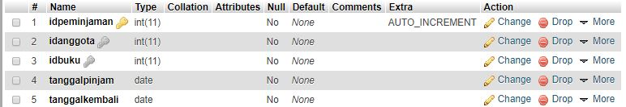

### Percobaan 2 

1. Nama Project 
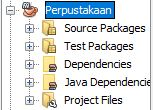

2. Library 
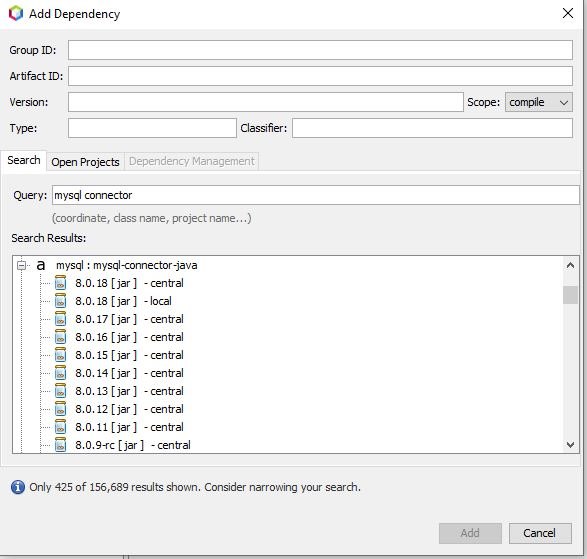

3. Package
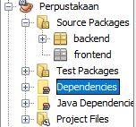

### Percobaan 3

1. Class DbHelper1941723009Hafid

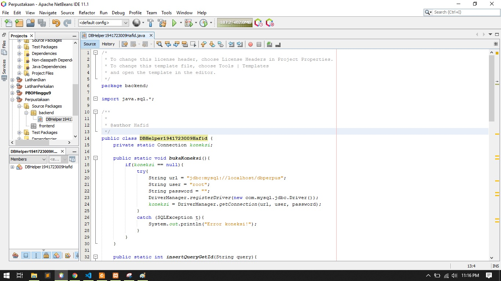

link kode program : [link kode](../../src/14_GUI_dan_Database/DBHelper1941723009Hafid.java)

2. import library

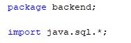

### Percobaan 4

1. Class Kategori1941723009Hafid

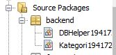

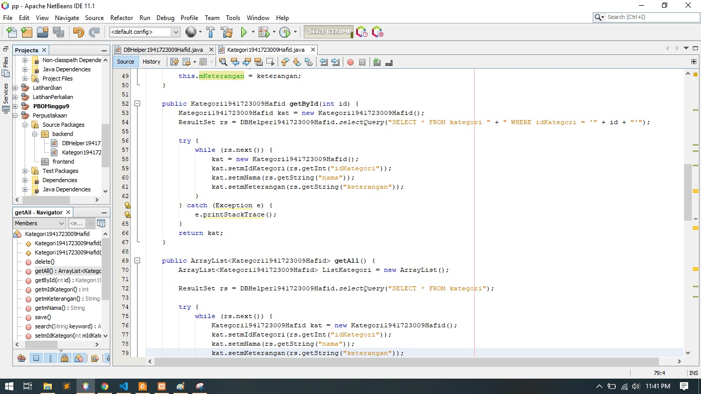

link kode program : [link kode](../../src/14_GUI_dan_Database/Kategori1941723009Hafid.java)

### Percobaan 5

1. Class testbackend1941723009Hafid

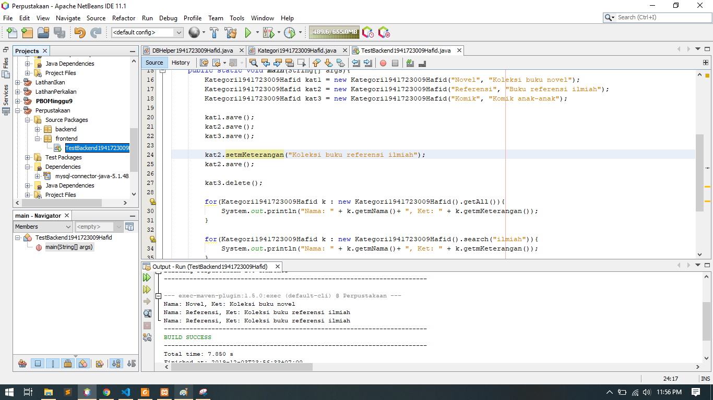

link kode program : [link kode](../../src/14_GUI_dan_Database/TestBackend1941723009Hafid.java)

2. Class frmkategori

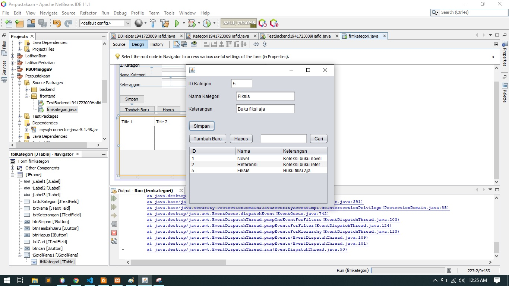

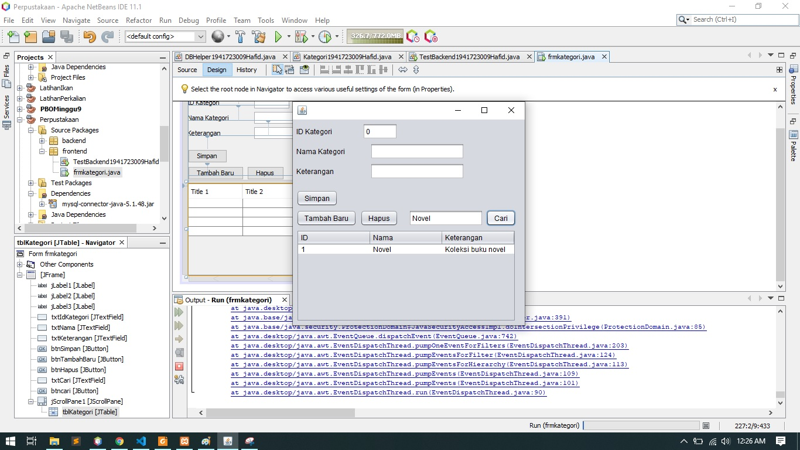

link kode program : [link kode](../../src/14_GUI_dan_Database/frmkategori.java)

### Percobaan 6

1. Class anggota1941723009Hafid

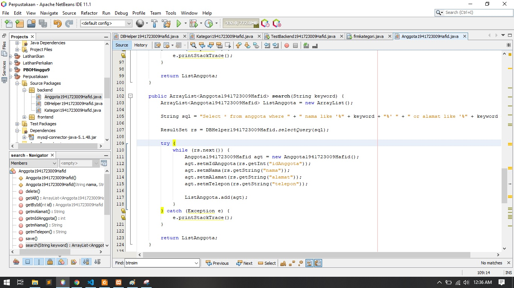

link kode program : [link kode](../../src/14_GUI_dan_Database/Anggota1941723009Hafid.java)

2. Class testbackendanggota1941723009Hafid

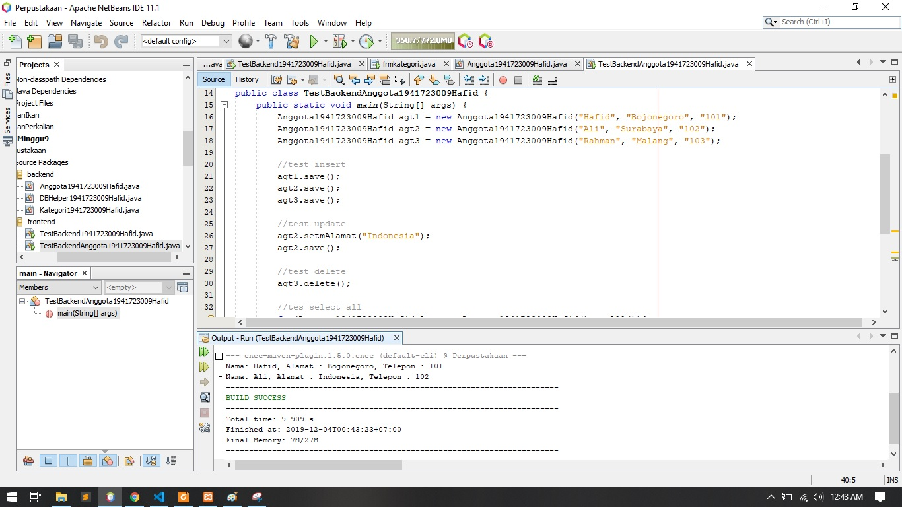

link kode program : [link kode](../../src/14_GUI_dan_Database/TestBackendAnggota1941723009Hafid.java)

### Percobaan 7

1. Class Anggota Frame

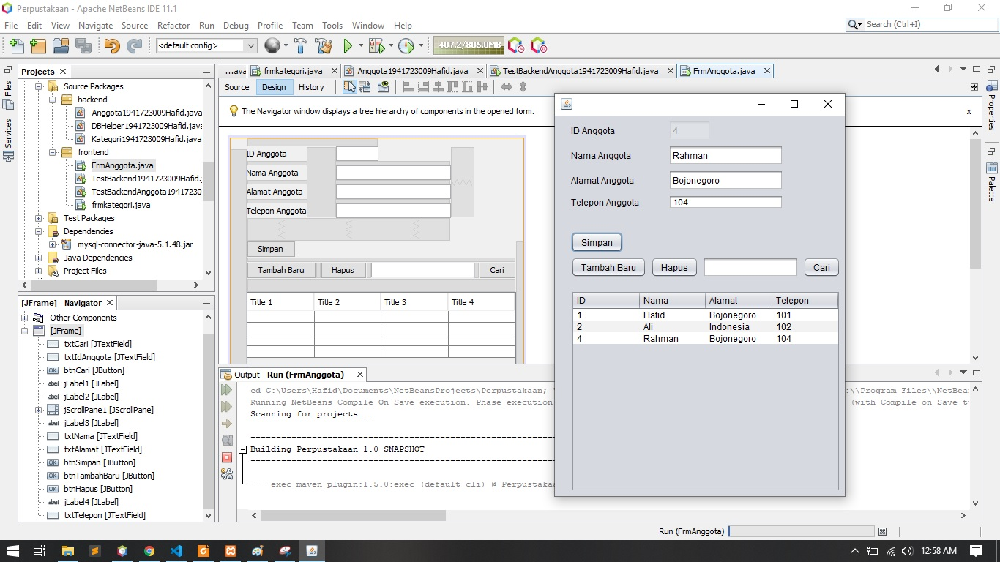

link kode program : [link kode](../../src/14_GUI_dan_Database/frmanggota.java)

### Percobaan 8
1. Class Buku Frame

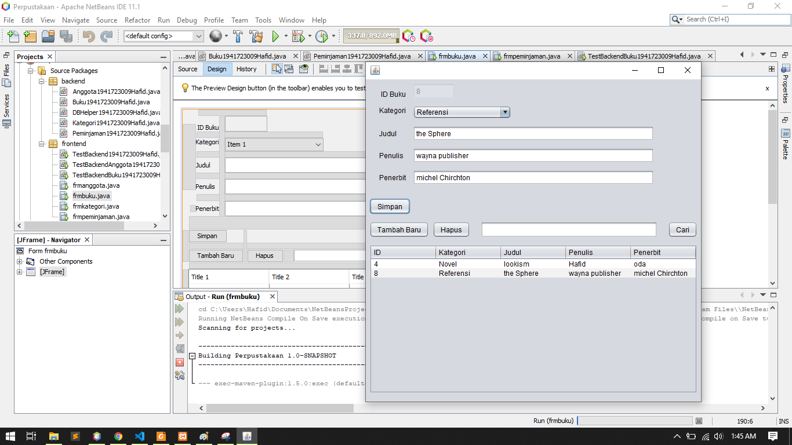

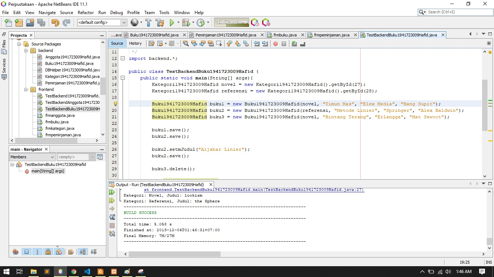

link kode program : [link kode](../../src/14_GUI_dan_Database/frmbuku.java)

link kode program : [link kode](../../src/14_GUI_dan_Database/TestBackendBuku1941723009Hafid.java)

### tugas

1. Class Buku Frame

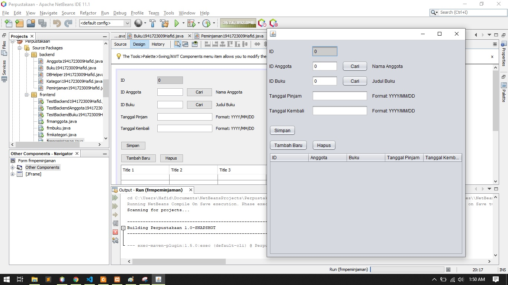

link kode program : [link kode](../../src/14_GUI_dan_Database/frmpeminjaman.java)

## Kesimpulan

yang saya pelajari dari kumpulan percobaan pada minggu ke 14 GUI dan database adalah mengisi, menghapus, dan menyimpan sebuah data lalu di masukkan kedalam database, percobaan tersebut hampir seperti percobaan minggu ke 12. 

## Pernyataan Diri

	Saya menyatakan isi tugas, kode program, dan laporan praktikum ini dibuat oleh saya sendiri. Saya tidak melakukan plagiasi, kecurangan, menyalin/menggandakan milik orang lain.

	Jika saya melakukan plagiasi, kecurangan, atau melanggar hak kekayaan intelektual, saya siap untuk mendapat sanksi atau hukuman sesuai peraturan perundang-undangan yang berlaku.

	Ttd,

	(Hafid Ali Rahman Wibisana)