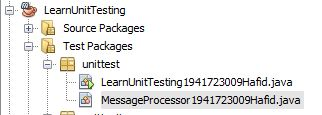
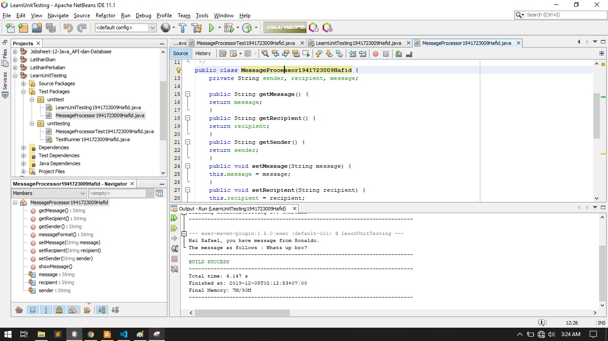
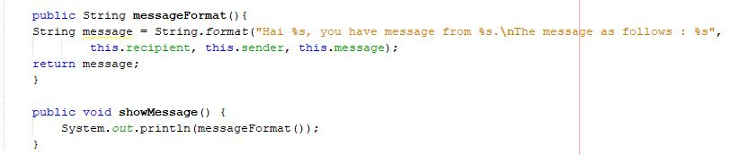
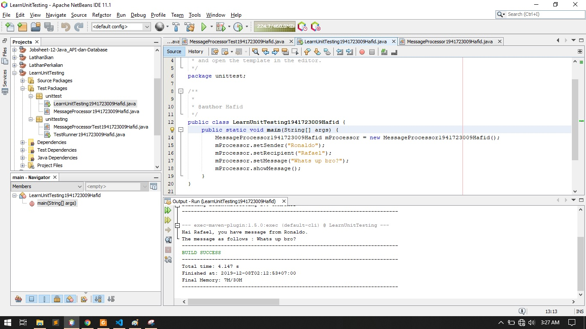
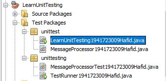
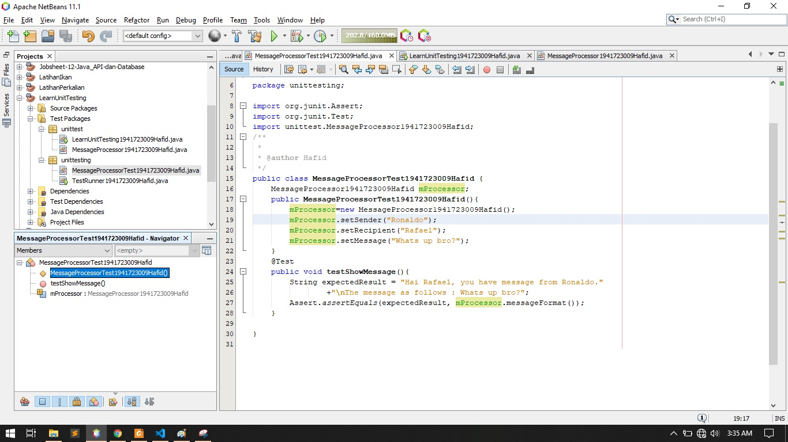
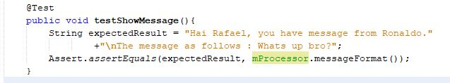
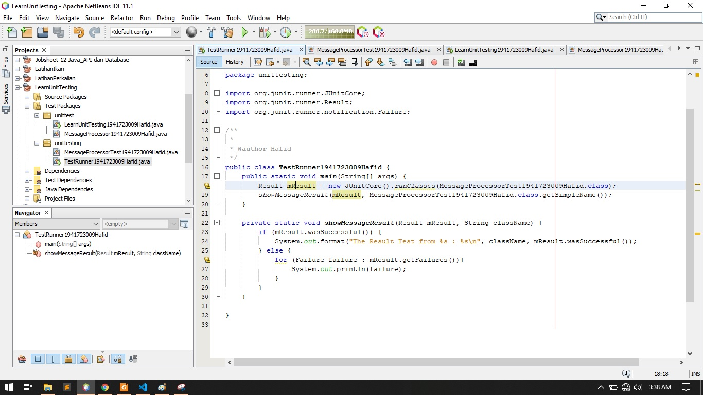
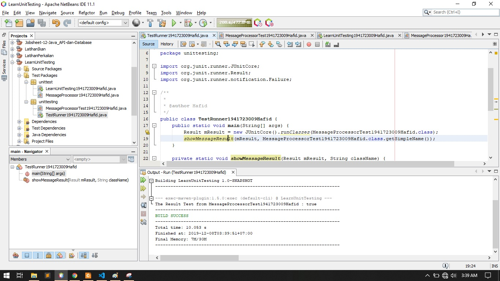
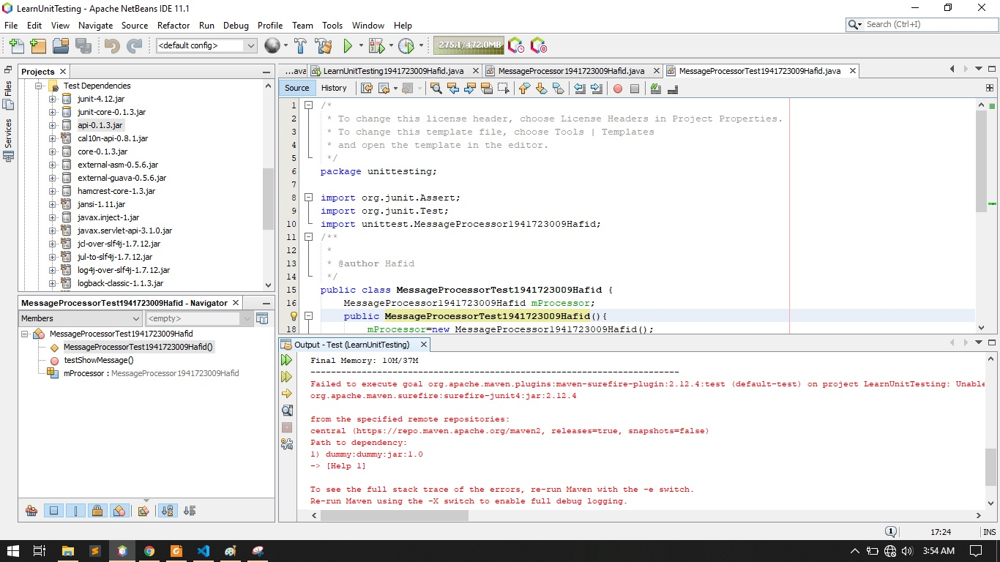

# Laporan #15 - Pengantar Konsep PBO

# Unit_Testing

## Kompetensi

Setelah menyelesaikan lembar kerja ini mahasiswa diharapkan mampu:
1. Memahami konsep dan fungsi unit testing
2. Menerapkan unit testing dengan JUnit pada program sederhana.
3. Menerapkan unit testing dengan JUnit pada progam yang terkoneksi database  

## Ringkasan Materi

### Pengertian Unit Testing

Unit Testing adalah pengujian sebuah fungsi, kelas, interface, prosedur dari sebuah aplikasi yang bersifat code. Unit Testing adalah sebuah metode yang masing-masing unit dari kode diuji untuk menentukan apakah fungsi dari kode-kode tersebut berjalan dengan baik atau tidak.

### Manfaat dari Unit Testing:

1. Masalah dapat ditemukan pada tahap awal. Sejak unit testing dilakukan oleh seorang developerdiaman merekan menguji bagian dari kodenya. oleh karena itu permasalahan dapat ditemukan sangat awal dan dapat diselesaikan oleh saat itu juga.
2. Unit testing membantu dalam mempertahankan/mengubah kode apabila ada perubahan dari aplikasi tersebut. hal ini dimungkinandengan membuat kode yang kurang, sehingga unti testing dapat dieksekusi. Sehingga memudahkan developer/programmer kedepanya.
3. Bug yang ditemukan saat unit testing juga membantu dalam biaya perbaikan bug/bug fixing. Bayangkan saja jika biaya bug yang ditemukan selama tahap akhir pembangunan sangat banyak, sehingga sangat memakan biaya untuk merubahnya apabila kita tidak mengetahui dari awal bug tersebut.
4. Unit Testing membantu dalam menyederhanakan proses debugging. Jika anggaplah tes gagal maka hanya Perubahan terakhir dibuat dalam kode.
5. Dan yang terakhir adalah waktu yang dibutuhkan dalam pengerjaan/maintenance sebuah aplikas tersebut lebih cepat dan efisien

## Percobaan

### Percobaan 1: Dasar Unit Testing

1. Project baru LearnUnitTesting

2. class MessageProccess

3. Menambahkan 2 method

4. class learnunittesting

5. Hasil main LearnUnitTesting

6. package unnittesting

7. Class MessageProccessTest

8. Menambah Method

9. Class TestRunner

10. Hasil TestRunner

11. Hasil Output(LearnUnitTesting)

kenapa kok masih eror pak? padahal di run file class testrunner hasilnya true.

### Percobaan 2 

1. Nama Project 

2. Library 

3. Package

### Percobaan 3

1. Class DbHelper1941723009Hafid

link kode program : [link kode](../../src/14_GUI_dan_Database/DBHelper1941723009Hafid.java)

2. import library

### Percobaan 4

1. Class Kategori1941723009Hafid

link kode program : [link kode](../../src/14_GUI_dan_Database/Kategori1941723009Hafid.java)

### Percobaan 5

1. Class testbackend1941723009Hafid

link kode program : [link kode](../../src/14_GUI_dan_Database/TestBackend1941723009Hafid.java)

2. Class frmkategori

link kode program : [link kode](../../src/14_GUI_dan_Database/frmkategori.java)

### Percobaan 6

1. Class anggota1941723009Hafid

link kode program : [link kode](../../src/14_GUI_dan_Database/Anggota1941723009Hafid.java)

2. Class testbackendanggota1941723009Hafid

link kode program : [link kode](../../src/14_GUI_dan_Database/TestBackendAnggota1941723009Hafid.java)

### Percobaan 7

1. Class Anggota Frame

link kode program : [link kode](../../src/14_GUI_dan_Database/frmanggota.java)

### Percobaan 8
1. Class Buku Frame

link kode program : [link kode](../../src/14_GUI_dan_Database/frmbuku.java)

link kode program : [link kode](../../src/14_GUI_dan_Database/TestBackendBuku1941723009Hafid.java)

### tugas

1. Class Buku Frame

link kode program : [link kode](../../src/14_GUI_dan_Database/frmpeminjaman.java)

## Kesimpulan

yang saya pelajari dari kumpulan percobaan pada minggu ke 14 GUI dan database adalah mengisi, menghapus, dan menyimpan sebuah data lalu di masukkan kedalam database, percobaan tersebut hampir seperti percobaan minggu ke 12. 

## Pernyataan Diri

	Saya menyatakan isi tugas, kode program, dan laporan praktikum ini dibuat oleh saya sendiri. Saya tidak melakukan plagiasi, kecurangan, menyalin/menggandakan milik orang lain.

	Jika saya melakukan plagiasi, kecurangan, atau melanggar hak kekayaan intelektual, saya siap untuk mendapat sanksi atau hukuman sesuai peraturan perundang-undangan yang berlaku.

	Ttd,

	(Hafid Ali Rahman Wibisana)