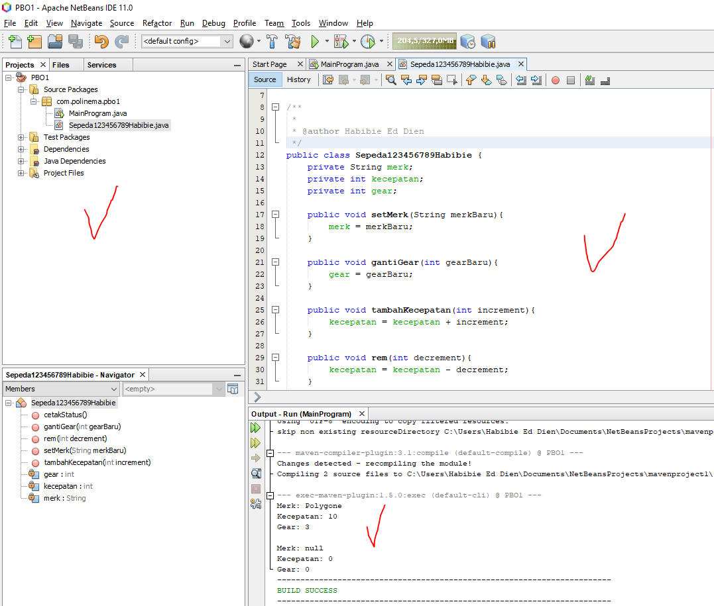

# Laporan Praktikum #1 - Pengantar Konsep PBO

## Kompetensi

(ID_Jobsheet-01-Pengantar Konsep PBO)

## Ringkasan Materi

(berisi catatan penting pribadi selama praktikum berlangsung ataupun menemukan permasalahan khusus saat melakukan percobaan)

## Percobaan

### Percobaan 1

()

`contoh screenshot yang benar, menampilkan 3 komponen, yaitu struktur project, kode program, dan hasil kompilasi`

Contoh link kode program : [ini contoh link ke kode program](../../src/1_Pengantar_Konsep_PBO/Contoh12345Habibie.java)

### Percobaan 2

(berisi penjelasan percobaan 2. Jika ada rujukan ke file program, bisa dibuat linknya di sini.)

`contoh screenshot yang benar, menampilkan 3 komponen, yaitu struktur project, kode program, dan hasil kompilasi`

Contoh link kode program : [ini contoh link ke kode program](../../src/1_Pengantar_Konsep_PBO/Sepeda.java)

## Pertanyaan

(1. Sebutkan dan jelaskan aspek-aspek yang ada pada pemrograman berorientasi objek!  
2. Apa yang dimaksud dengan object dan apa bedanya dengan class?  
3. Sebutkan salah satu kelebihan utama dari pemrograman berorientasi objek dibandingkan dengan pemrograman struktural! 
4. Pada class Sepeda, terdapat state/atribut apa saja? 
5. Tambahkan atribut warna pada class Sepeda. 
6. Mengapa pada saat kita membuat class SepedaGunung, kita tidak perlu membuat class nya dari nol? )

## Tugas

(silakan kerjakan tugas di sini beserta `screenshot` hasil kompilasi program. Jika ada rujukan ke file program, bisa dibuat linknya di sini.)

`contoh screenshot yang benar, menampilkan 3 komponen, yaitu struktur project, kode program, dan hasil kompilasi`

Contoh link kode program : [ini contoh link ke kode program](../../src/1_Pengantar_Konsep_PBO/Contoh12345Habibie.java)

## Kesimpulan

(Berisi simpulan yang telah diperoleh selama praktikum atau belajar pada pertemuan ini)

## Pernyataan Diri

Saya menyatakan isi tugas, kode program, dan laporan praktikum ini dibuat oleh saya sendiri. Saya tidak melakukan plagiasi, kecurangan, menyalin/menggandakan milik orang lain.

Jika saya melakukan plagiasi, kecurangan, atau melanggar hak kekayaan intelektual, saya siap untuk mendapat sanksi atau hukuman sesuai peraturan perundang-undangan yang berlaku.

Ttd,

***(silakan isi nama lengkap di sini)***
