# Laporan Praktikum #2 - Class_dan_Object

## Kompetensi

 Mahasiswa dapat memahami deskripsi dari class dan object  
 Mahasiswa memahami implementasi dari class  
 Mahasiswa dapat memahami implementasi dari attribute  
 Mahasiswa dapat memahami implementasi dari method 
 Mahasiswa dapat memahami implementasi dari proses instansiasi  
 Mahasiswa dapat memahami implementasi dari try-catch  
 Mahasiswa dapat memahami proses pemodelan class diagram menggunakan UML 

## Ringkasan Materi

(berisi catatan penting pribadi selama praktikum berlangsung ataupun menemukan permasalahan khusus saat melakukan percobaan)

## Percobaan

### Percobaan 1

1. 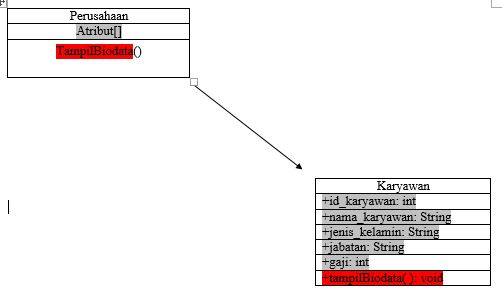 
2. Class Perusahaan dan Karyawan 
3. Class Karyawan  
atribut 
idKaryawan int 
namaKaryawan String 
jenisKelamin String 
jabatan String 
gaji int 
4. 1001 
Hafid 
Pria 
Supervisior 
2000000 

`contoh screenshot yang benar, menampilkan 3 komponen, yaitu struktur project, kode program, dan hasil kompilasi`

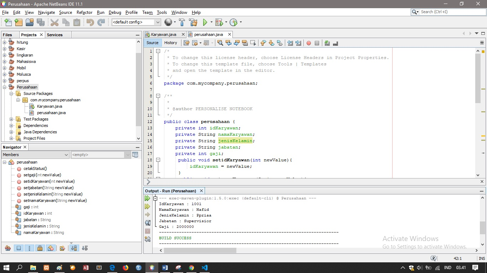 
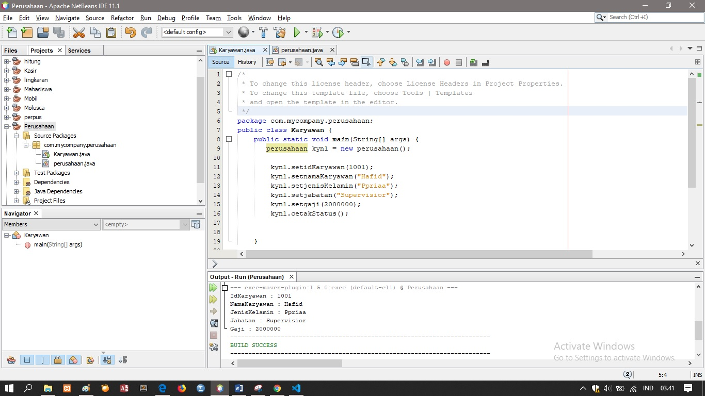 

link kode program : [ini link ke kode program](/../src/2_Class_and_Object/perusahaan.java) 
link kode program : [ini link ke kode program](/../src/2_Class_and_Object/Karyawan.java) 

### Percobaan 2

pembuatan class mahasiswa 

`contoh screenshot yang benar, menampilkan 3 komponen, yaitu struktur project, kode program, dan hasil kompilasi`

1. Bagian Mahasiswa 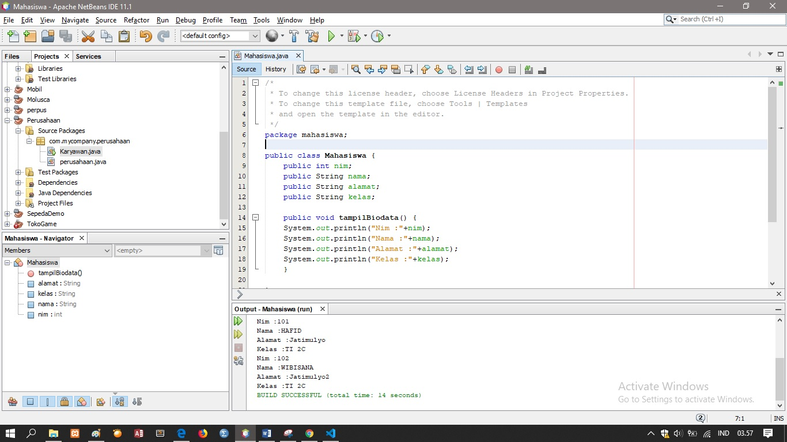 

link kode program : [contoh link ke kode program](../../src/2_Class_dan_Object/Mahasiswa.java) 

2. Bagian TestMahasiswa 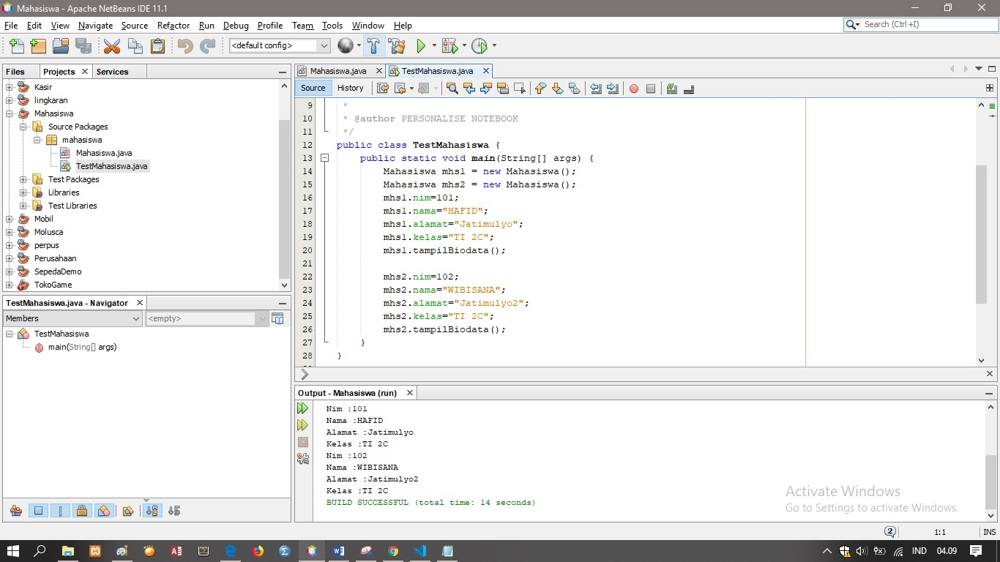 

link kode program : [contoh link ke kode program](../../src/2_Class_dan_Object/TestMahasiswa.java) 

Essai 
7. bagian pendeklarasian atribut adalah nim, nama, alamat, dan kelas. 
   public void tampilBiodata() { 
    	System.out.println("Nim :"+nim);
    	System.out.println("Nama :"+nama);
    	System.out.println("Alamat :"+alamat);   
   	System.out.println("Kelas :"+kelas);
8. bagian pendeklarasian method adalah 101, HAFID, Jatimulyo, TI 2C, dan TampilBiodata 
	mhs1.nim=101;
        mhs1.nama="HAFID";
        mhs1.alamat="Jatimulyo";
        mhs1.kelas="TI 2C";
        mhs1.tampilBiodata();
9. 1 object yaitu Mahasiswa.java 
10. yang dilakukan pada sintaks tersebut adalah untuk menginput method kedalam atribut 
11. yang dilakukan pada sintaks tersebut adalah untuk menampilkan seluruh method yang ada pada atribut 
12. Bagian Instasiasi 2 object 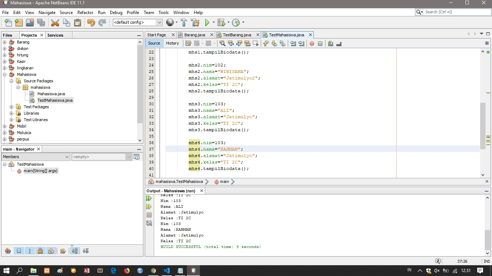 

link kode program : [contoh link ke kode program](../../src/2_Class_dan_Object/TestMahasiswa.java) 

## Percobaan 3: Menulis method yang memiliki argument/parameter dan memiliki return

1,2,3.  Bagian Barang 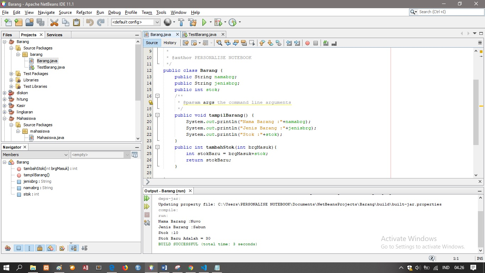 

link kode program : [link ke kode program](../../src/2_Class_dan_Object/Barang.java) 

4,5,6. Bagian TestBarang 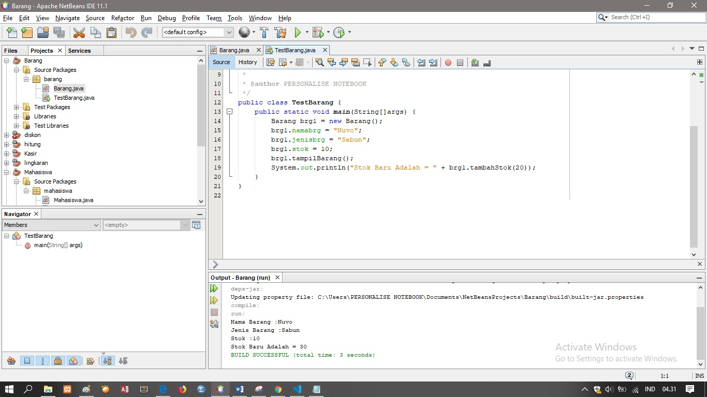 

link kode program : [link ke kode program](../../src/2_Class_dan_Object/testBarang.java) 

7. fungsi argumen dalam suatu method adalah untuk menambahkan/menginput stok barang 
8. kesimpulan tentang kegunaan kata kunci return adalah return berfungsi untuk mengembalikan nilai dari suatu variabel dan ditambahkan nilai input 
ketika suatu method ingin mengembalikan nilai variabelnya secara langsung 

## Pertanyaan
 () 
## Tugas
1. Suatu toko persewaan video game salah satu yang diolah adalah peminjaman, dimana data yang dicatat ketika ada orang yang melakukan peminjaman adalah id, nama member, nama game, dan harga yang harus dibayar.  Setiap peminjaman bisa menampilkan data hasil peminjaman dan harga yang harus dibayar.  Buatlah class diagram pada studi kasus diatas!
Penjelasan: 
a. Harga yang harus dibayar diperoleh dari lama sewa x harga. 
b. Diasumsikan 1x transaksi peminjaman game yang dipinjam hanya 1 game saja. 
Bagian TokoGaming 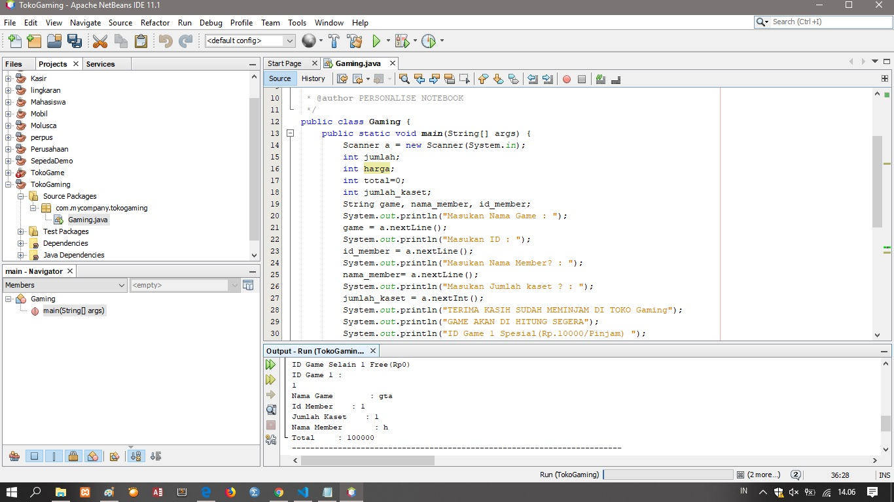 

link kode program : [link ke kode program](../../src/2_Class_dan_Object/Gaming.java) 
2. jadi satu sama nomer 1 

3. Program Hitung Jari-Jari lingkaran
Bagian Lingkaran 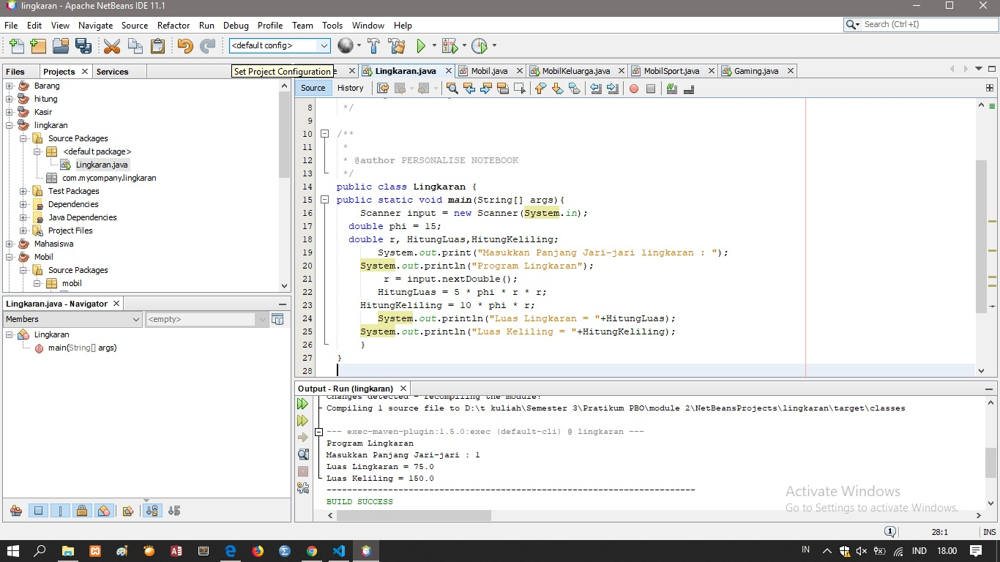 

link kode program : [link ke kode program](../../src/2_Class_dan_Object/Lingkaran.java) 
4. Program Pembayaran Dengan Diskon 
Pada program ini terdapat objek dan class seperti class Barang dan TestBarang dimana di dalamnya terdapat objek Barang meliputi kodeBarang, namaBarang, dan harga.
Bagian Diskon 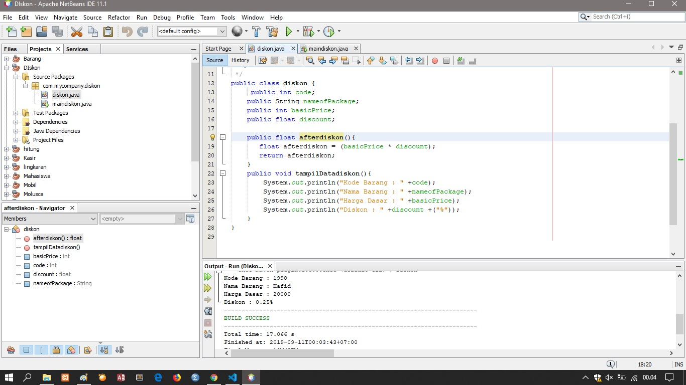 

link kode program : [link ke kode program](../../src/2_Class_dan_Object/diskon.java) 
Bagian MainDiskon 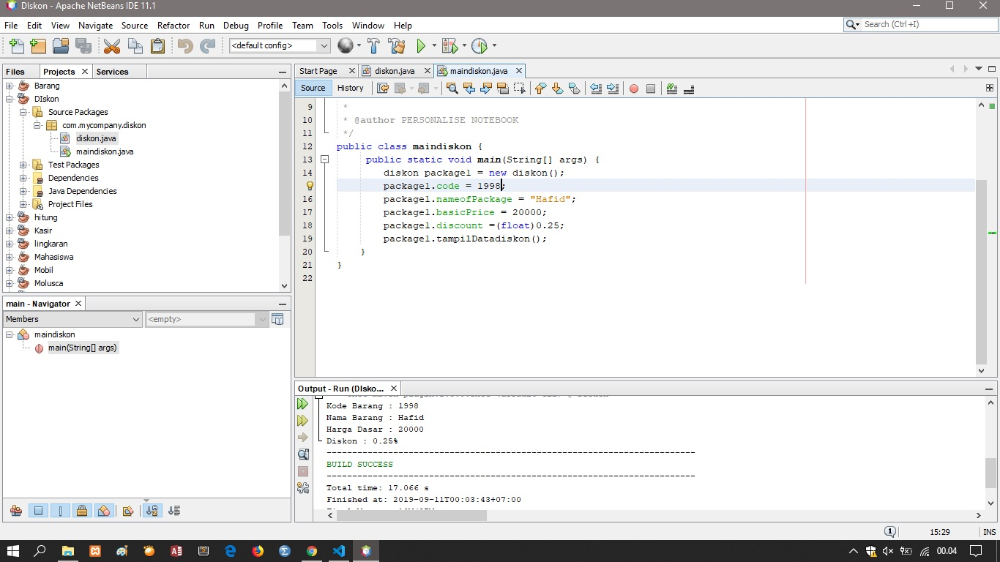 

link kode program : [link ke kode program](../../src/2_Class_dan_Object/maindiskon.java) 
## Kesimpulan

return memiliki fungsi yang terbilang penting karena bisa mengembalikan nilai tanpa harus menulis kembali nilai tersebut

## Pernyataan Diri

Saya menyatakan isi tugas, kode program, dan laporan praktikum ini dibuat oleh saya sendiri. Saya tidak melakukan plagiasi, kecurangan, menyalin/menggandakan milik orang lain.

Jika saya melakukan plagiasi, kecurangan, atau melanggar hak kekayaan intelektual, saya siap untuk mendapat sanksi atau hukuman sesuai peraturan perundang-undangan yang berlaku.

Ttd,

(HAFID ALI RAHMAN WIBISANA)
