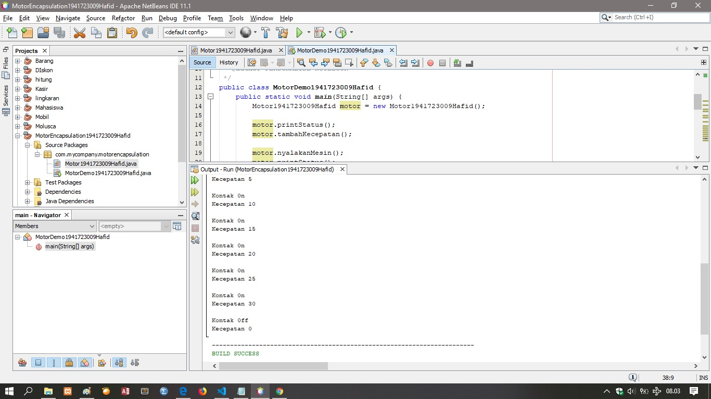
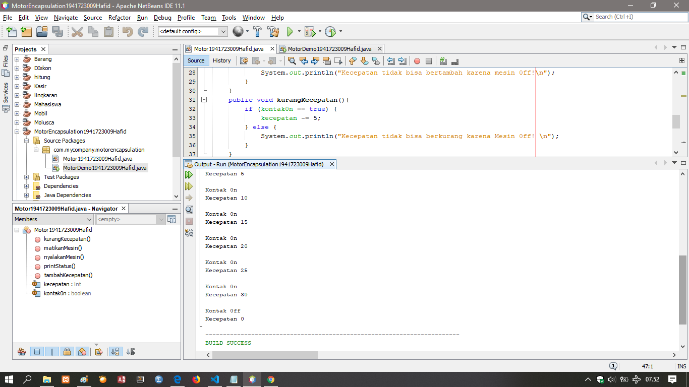
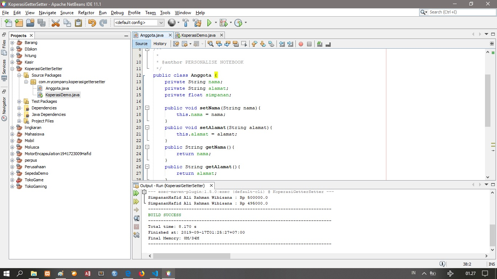
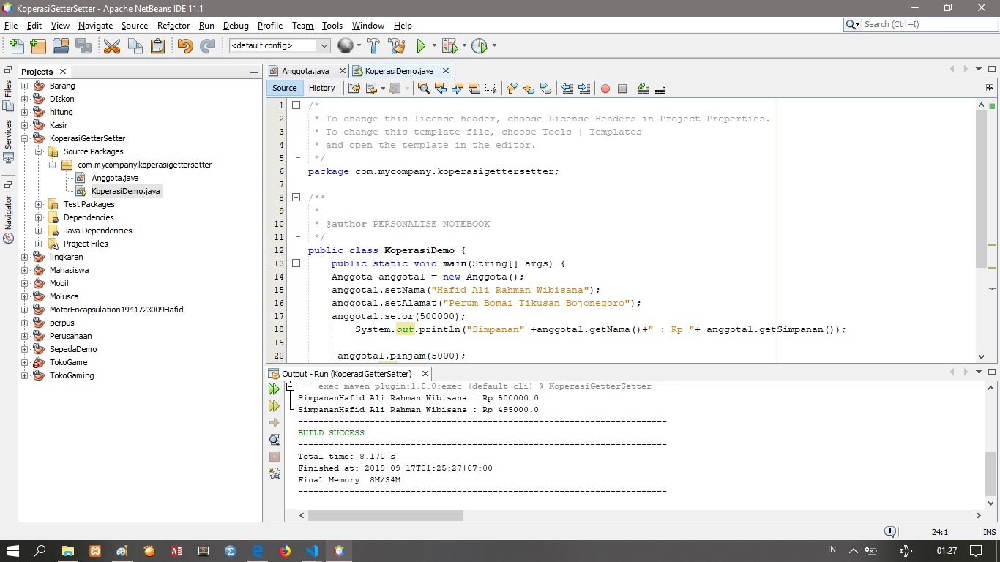
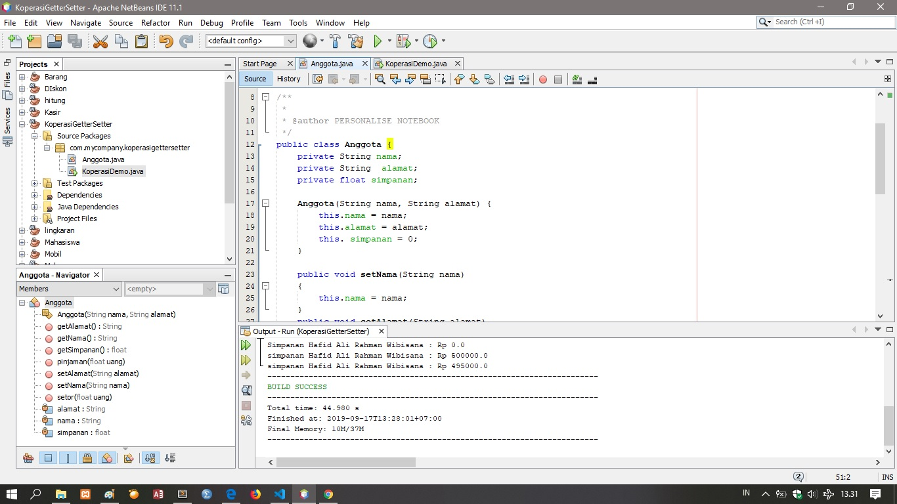
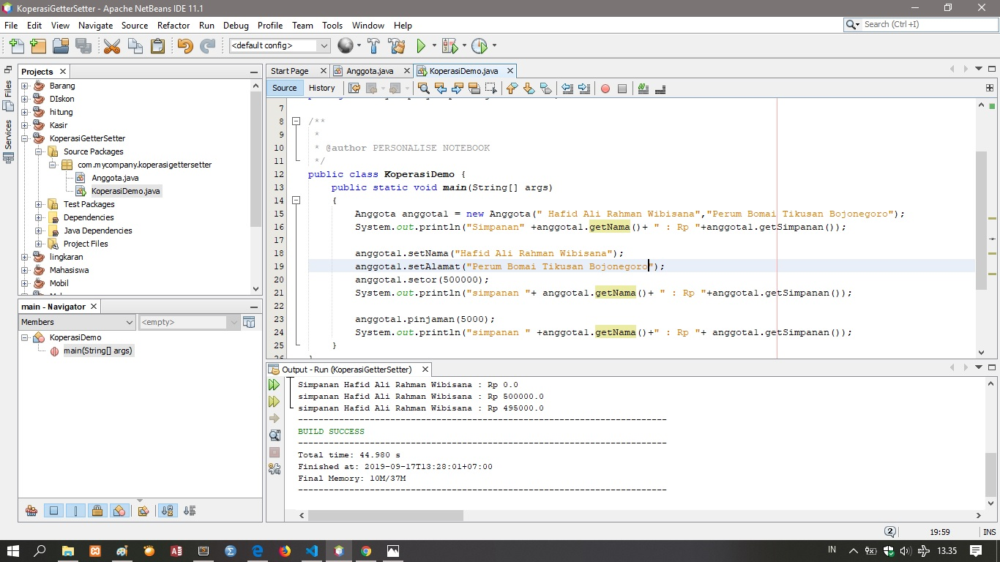
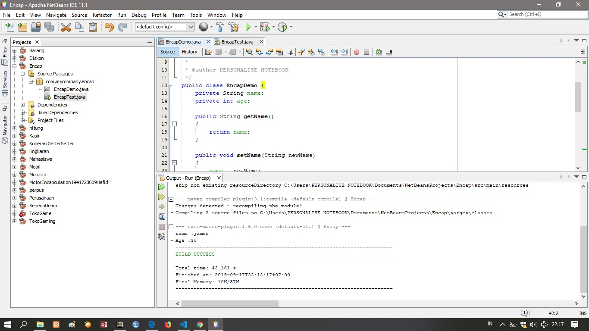
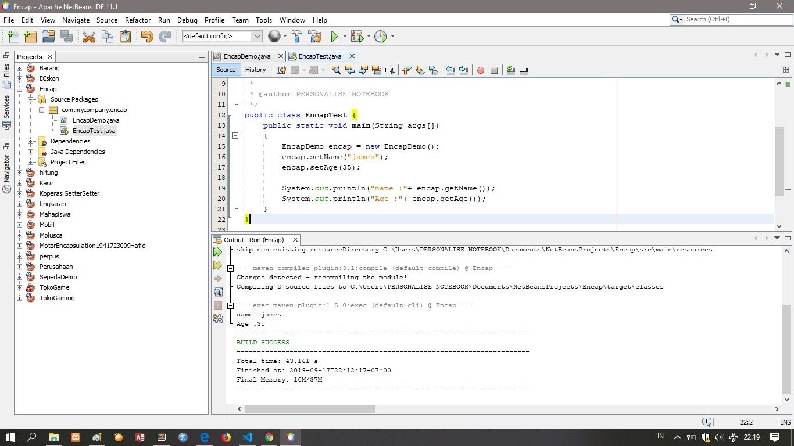
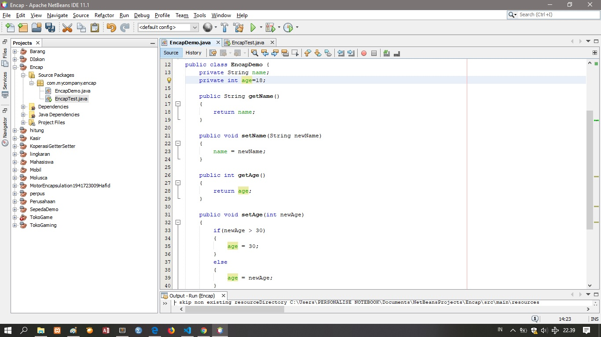

# Laporan Praktikum #2 - Class_dan_Object

## Kompetensi

Setelah melakukan percobaan pada modul ini, mahasiswa memahami konsep: 
1. Konstruktor 
2. Akses Modifier 
3. Atribut/method pada class 
4. Intansiasi atribut/method  
5. Setter dan getter 
6. Memahami notasi pada UML Class Diagram 

## Ringkasan Materi

Enkapsulasi adalah suatu cara untuk menyembunyikan informasi detail dari suatu class dan memiliki 4 akses modifier yaitu private(-), public(+), protected(#) dan default yang tidak memiliki simbol.

konstruktor adalah method khusus yang akan dijalankan secara otomatis pada saat sebuah objek dibuat (instansiasi), yakni ketika perintah “new” dijalankan biasa disebut dengan memasukkan nilai variabel pada saat instansiasi/membuat objek

Instansiasi adalah istilah yang memiliki perwujudan,umumnya istilah ini digunakan untuk objek" yang menginisiasi dari sebuah class, sedangkan sebuah class dapat mempunyai banyak object. Untuk dapat membuat sebuah objek, kita perlu melakukan instansiasi
## Percobaan

## Percobaan 1 bagian Encapsulasi 

1. Percobaan 1

yang janggal di hasil percobaan 1 adalah ketika mesin off kecepatan 50

*link kode program : [ini link ke kode program](../../src/3_Encapsulation/Motor1941723009Hafid.java)

*link kode program : [ini link ke kode program](../../src/3_Encapsulation/MotorDemo1941723009Hafid.java)

*link kode program : [ini link ke kode program](../../src/3_Encapsulation/Motor1941723009Hafid.java)

*link kode program : [ini link ke kode program](../../src/3_Encapsulation/MotorDemo1941723009Hafid.java)

## Percobaan 2 bagian Access Modifier

1. Bagian Motor1941723009Hafid   

*link kode program : [ini link ke kode program](../../src/3_Encapsulation/Motor1941723009Hafid.java)

2. Bagian MotorDemo1941723009Hafid 

link kode program : [ini link ke kode program](../../src/3_Encapsulation/MotorDemo1941723009Hafid.java)
## Percobaan 2 bagian Access Modifier soal
1. karena -kontak0n:boolean = false dan didalam perintah tambahKecepatan tertulis perintah jika kontak0n = true,
maka kecepatan bertambah jika tidak, sistem akan menampilkan "Kecepatan tidak bisa bertambah karena Mesin Off!".
2. atribut kecepatan dan kontakOn diset private karena private – hanya dapat diakses di dalam kelas yang sama dan 
telah menerapkan enkapsulasi atau disebut juga information-hiding atau data hiding karena menyembunyikan detail proses suatu objek dari pengguna.
oleh sebab itu proses kecepatan dan kontak0n di sembunyikan dari pengguna dan hanya menampilkan hasil.
3. 

## Percobaan 3: Getter dan Setter 

Bagian anggota 

link kode program : [link ke kode program](../../src/3_Encapsulation/Anggota.java)

Bagian KoperasiDemo 

link kode program : [link ke kode program](../../src/3_Encapsulation/KoperasiDemo.java)

#### Percobaan 4 : Konstruktor, Instansiasi
Bagian anggota 

link kode program : [link ke kode program](../../src/3_Encapsulation/Anggota.java)

Bagian KoperasiDemo 

link kode program : [link ke kode program](../../src/3_Encapsulation/KoperasiDemo.java)
## Pertanyaan
 1. Apa yang dimaksud getter dan setter?
Method setter dan getter adalah dua method yang tugasnya untuk mengambil dan mengisi data ke dalam objek.
Dalam OOP kita sering mendengar istilah encapsulation (pembungkusan), di mana data dibungkus dengan modifier private agar tidak bisa diakses secara langsung dari luar class.
2. Apa kegunaan dari method getSimpanan()?
kegunaanya adalah untuk mengambil suatu nilai dari void setor
3. Method apa yang digunakan untk menambah saldo?
method yang digunakan untuk menambah saldo adalah method setor
4. Apa yand dimaksud konstruktor?
adalah method khusus yang akan dijalankan secara otomatis pada saat sebuah objek dibuat (instansiasi), yakni ketika perintah “new” dijalankan biasa disebut dengan memasukkan nilai variabel pada saat instansiasi/membuat objek 
5. Sebutkan aturan dalam membuat konstruktor?
dapat di overload,default konstruktor diberikan oleh kompiler java, kostruktor tidak dapat diwariskan, dan konstruktor bisa memiliki acces modifier private  
6. Apakah boleh konstruktor bertipe private? iya boleh suatu konstruktor bertipe privat
7. Kapan menggunakan parameter dengan passing parameter? 
ketika passing parameter ingin mengambil sebuah nilai dari method dan tidak mengubah nilai awal parameter
8. Apa perbedaan atribut class dan instansiasi atribut
Atribut Class adalah kumpulan rancangan dari method contoh Class rumah atributnya pintu,atap dan kamar jika instansiasi atribut adalah berfungsi untuk mengeluarkan hasil output dari atribut class, agar tidak menambahkan atribut yang sudah ada.
9. Apa perbedaan class method dan instansiasi method?
Metode class adalah sekumpulan statement program yang disatukan menjadi sebuah subprogram atau fungsi yang masih berupa rancangan, kalau instansiasi method adalah pembuatan method baru menurut fungsinya
## Tugas
1.  Cobalah program dibawah ini dan tuliskan hasil         outputnya 
    Bagian EncapDemo 

    link kode program : [link ke kode program](../../src/3_Encapsulation/EncapDemo.java)
 
    Bagian EncapTest 

    link kode program : [link ke kode program](../../src/3_Encapsulation/EncapTest.java)

2. Pada program diatas, pada class EncapTest kita mengeset age dengan nilai 35, namun pada saat ditampilkan ke layar nilainya 30, jelaskan mengapa.
karena di class Encapdemo terdapat fungsi if dengan menetapkan nilai atribut age sebanyak 30.

3. Ubah program diatas agar atribut age dapat diberi nilai maksimal 30 dan minimal 18
,memberi nilai maksimal terdapat pada fungsi if dengan atribut age dan memberi nilai minimal 18 dengan cara memasukkan nilai di atribut yang berada di dalam acces modifier

4. 
    
    Bagian EncapDemo 
 

## Kesimpulan

## Pernyataan Diri

Saya menyatakan isi tugas, kode program, dan laporan praktikum ini dibuat oleh saya sendiri. Saya tidak melakukan plagiasi, kecurangan, menyalin/menggandakan milik orang lain.

Jika saya melakukan plagiasi, kecurangan, atau melanggar hak kekayaan intelektual, saya siap untuk mendapat sanksi atau hukuman sesuai peraturan perundang-undangan yang berlaku.

Ttd,

(HAFID ALI RAHMAN WIBISANA)
