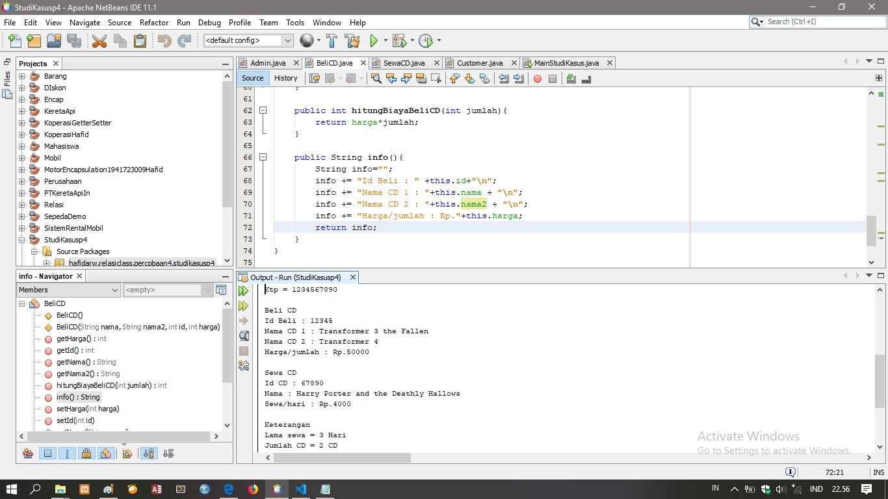

# Laporan Praktikum #4 - Relasi_Class

## Kompetensi

    Setelah menempuh pokok bahasan ini, mahasiswa mampu: 
    1. Memahami konsep relasi kelas; 
    2. Mengimplementasikan relasi has‑a dalam program.  

## Ringkasan Materi
    Dalam paradigma pemrograman berorientasi objek, sebuah aplikasi dibangun dengan menggabungkan beberapa kelas. Kelas-kelas tersebut saling bekerjasama untuk menyelesaikan suatu masalah.
    Dalam aplikasi yang berukuran yang cukup kompleks, banyak kelaskelas yang terlibat dalam aplikasi tersebut. Maka untuk aplikasi yang kompleks tersebut dibutuhkan pemodelan kelas untuk menggambarkan aplikasi yang dibangun.
    
    Jenis-jenis Relasi Antar Kelas
    Seperti yang telah dinyatakan sebelumnya, bahwa sebuah aplikasi yang dibangun dengan menggunakan paradigma OOP akan menggunakan banyak kelas. Kelas-kelas tersebut saling berhubungan antara satudengan yang lainnya. Hal ini menimbulkan relasi antar kelas.

    Terdapat beberapa macam relasi antar kelas yaitu :
    *Inheritance
    *Realization
    *Dependency
    *Aggregation
    *Composition 

# Praktikum

## Percobaan 1           

Bagian Laptop

link kode program : [ini link ke kode program](../../src/4_Relasi_Class/Laptop.java)

Bagian Processor 

link kode program : [ini link ke kode program](../../src/4_Relasi_Class/Processor.java)

Bagian main 

link kode program : [ini link ke kode program](../../src/4_Relasi_Class/MainPercobaan1.java)

## Percobaan 2 

Bagian Pelanggan

link kode program : [ini link ke kode program](../../src/4_Relasi_Class/Pelanggan.java)

Bagian Mobil

link kode program : [ini link ke kode program](../../src/4_Relasi_Class/Mobil.java)

Bagian Sopir

link kode program : [ini link ke kode program](../../src/4_Relasi_Class/Sopir.java)

Bagian main 2

link kode program : [ini link ke kode program](../../src/4_Relasi_Class/MainPercobaan2.java)

## Percobaan 3 

Bagian Kereta Api

link kode program : [ini link ke kode program](../../src/4_Relasi_Class/KeretaApi.java)

Bagian Pegawai

link kode program : [ini link ke kode program](../../src/4_Relasi_Class/Pegawai.java)

Bagian main 3

link kode program : [ini link ke kode program](../../src/4_Relasi_Class/MainPercobaan3.java)

## Percobaan 4 
Bagian Gerbong

link kode program : [ini link ke kode program](../../src/4_Relasi_Class/Gerbong.java)

Bagian Kursi

link kode program : [ini link ke kode program](../../src/4_Relasi_Class/Kursi.java)

Bagian Penumpang

link kode program : [ini link ke kode program](../../src/4_Relasi_Class/Penumpang.java)

Bagian Main 4

link kode program : [ini link ke kode program](../../src/4_Relasi_Class/MainPercobaan4.java)
## Pertanyaan

# Percobaan 1

    1. Di dalam class Processor dan class Laptop , terdapat method setter dan getter untuk masing-masing atributnya. Apakah gunanya method setter dan getter tersebut ?
    jawab : method setter dan getter berguna untuk perintah menetapkan nilai dan mengambil nilai dari konstruktor.

    2. Di dalam class Processor dan class Laptop, masing-masing terdapat konstruktor default dan konstruktor berparameter. 
    Bagaimanakah beda penggunaan dari kedua jenis konstruktor tersebut ? 
    Page 4 of 10 
    jawab : konstruktor default berguna untuk menginisialisasi variabel instance sesuai dengan type datanya sedangkan konstruktor berparameter berguna untuk menetapkan menetapkan variabel instance sesuai dengan type datanya.

    3. Perhatikan class Laptop, di antara 2 atribut yang dimiliki (merk dan proc), atribut manakah yang bertipe object ?
    jawab : Atribut yang bertipe objek adalah proc karena mengambil nilai dari processor dengan menggunakan nama alias p.

    4. Perhatikan class Laptop, pada baris manakah yang menunjukan bahwa class Laptop memiliki relasi dengan class Processor ?
    jawab : pada baris atribut di dalam class laptop yang bertuliskan private Processor proc;

    5. Perhatikan pada class Laptop , Apakah guna dari sintaks proc.info() ?
    jawab : proc.info() didalam class laptop berguna untuk menampilkan informasi di dalam Class Processor
    
    6. Pada class MainPercobaan1, terdapat baris kode: Laptop l = new Laptop("Thinkpad", p);. 
    Apakah p tersebut ? Dan apakah yang terjadi jika baris kode tersebut diubah menjadi: Laptop l = new Laptop("Thinkpad", new Processor("Intel i5", 3));
    jawab : p adalah nama alias untuk objek variabel pertama yang sesudah menjadi nama alias,   
    Bagaimanakah hasil program saat dijalankan, apakah ada perubahan ? 
    jawab : hasil yang terjadi adalah eror karena jika menambahkan variabel new Laptop sama dengan meanmbah kan alias baru.

## Percobaan 2

    1. Perhatikan class Pelanggan. Pada baris program manakah yang menunjukan bahwa class Pelanggan memiliki relasi dengan class Mobil dan class Sopir ?
    jawab : pada baris program di dalam class pelanggan yang bertuliskan private Mobil mobil;, private Sopir sopir; dan
    di baris public int HitungBiayaTotal();

    2. Perhatikan method hitungBiayaSopir pada class Sopir, serta method hitungBiayaMobil pada class Mobil. 
    Mengapa menurut Anda method tersebut harus memiliki argument hari ? 
    Page 6 of 10 
    jawab : karena method tersebut berguna untuk menghitung total biaya sewa/hari
    
    3. Perhatikan kode dari class Pelanggan. Untuk apakah perintah mobil.hitungBiayaMobil(hari) dan sopir.hitungBiayaSopir(hari) ?
    jawab : berfungsi sebagai menghitung biaya total dari penyewaan Mobil dan Sopir 
    
    4. Perhatikan class MainPercobaan2. Untuk apakah sintaks p.setMobil(m) dan p.setSopir(s) ?
    jawab : sintaks tersebut berfungsi untuk mengambil nilai variable dari objek yang dibuat waktu instasiasi.

    5. Perhatikan class MainPercobaan2. Untuk apakah proses p.hitungBiayaTotal() tersebut ? 
    jawab : proses tersebut berfungsi untuk menghitung nilai di dalam 2 objek sekaligus dengan menggunakan nama alias p = objek pelanggan yang merelasi ke objek mobil dan sopir setelah itu di hitung nilai keseluruhan
    
    6. Perhatikan class MainPercobaan2, coba tambahkan pada baris terakhir dari method main dan amati perubahan saat di-run! 
    System.out.println(p.getMobil().getMerk()); 
    Jadi untuk apakah sintaks p.getMobil().getMerk() yang ada di dalam method main tersebut?
    jawab : sintaks tersebut berguna untuk menampilkan pengambilan variabel dari objek Mobil

## Percobaan 3
    1. Di dalam method info() pada class KeretaApi, baris this.masinis.info() dan this.asisten.info() digunakan untuk apa jawab : baris tersebut berfungsi untuk menetapkan nilai variabel dari objek yang telah dibuat.

    2. Buatlah main program baru dengan nama class MainPertanyaan pada package yang sama. Tambahkan kode berikut pada method main() !  
    Pegawai masinis = new Pegawai("1234", "Spongebob Squarepants"); KeretaApi keretaApi = new KeretaApi("Gaya Baru", "Bisnis", masinis); 
    System.out.println(keretaApi.info());

jawab : Bagian Main Pertanyaan

link kode program : [ini link ke kode program](../../src/4_Relasi_Class/MainPertanyaan.java)

    3. Apa hasil output dari main program tersebut ? Mengapa hal tersebut dapat terjadi ? 
    jawab : hasilnya sama saja, karena cara menampilkan nilai variabelnya sama.

    4. Perbaiki class KeretaApi sehingga program dapat berjalan !

jawab : Bagian kereta api

link kode program : [ini link ke kode program](../../src/4_Relasi_Class/KeretaApi.java)

## Percobaan 4
    1. Pada main program dalam class MainPercobaan4, berapakah jumlah kursi dalam Gerbong A ?
    jawab : kursi di dalam Gerbong A terdapat 10 kursi.

    2. Perhatikan potongan kode pada method info() dalam class Kursi. Apa maksud kode tersebut ?  
    ... if (this.penumpang != null) { info += "Penumpang: " + penumpang.info() + "\n"; } ...
    jawab : maksut kode tersebut adalah suatu cara untuk proses menampilkan nilai variabel dari objek.

    3. Mengapa pada method setPenumpang() dalam class Gerbong, nilai nomor dikurangi dengan angka 1 ?
    jawab : karena menyeleksi dari nomor 10 sampai dengan i, i = -1 

    4. Instansiasi objek baru budi dengan tipe Penumpang, kemudian masukkan objek baru tersebut pada gerbong dengan gerbong.setPenumpang(budi, 1). Apakah yang terjadi ?
jawab: Bagian Budi 
    5. Modifikasi program sehingga tidak diperkenankan untuk menduduki kursi yang sudah ada penumpang lain 
jawab: Bagian tambah penumpang
    Deskripsi : menambahkan objek baru yang sudah di instasiasi dengan cara memberi nilai kursi yang masih kosong di gerbong yang sama misal nilai kursi 2 karena nilai kursi 1 sudah ada penumpang.

## Tugas
    Buatlah sebuah studi kasus, rancang dengan class diagram, kemudian implementasikan ke dalam program! Studi kasus harus mewakili relasi class dari percobaan‑percobaan yang telah dilakukan pada materi ini, setidaknya melibatkan minimal 4 class (class yang berisi main tidak dihitung).

Bagian Admin

link kode program : [ini link ke kode program](../../src/4_Relasi_Class/Admin.java) 
 
Bagian Sewa 

link kode program : [ini link ke kode program](../../src/4_Relasi_Class/SewaCD.java)

Bagian Beli

link kode program : [ini link ke kode program](../../src/4_Relasi_Class/BeliCD.java)

Bagian Customer

link kode program : [ini link ke kode program](../../src/4_Relasi_Class/Customer.java)

Bagian Main Studi Kasus

link kode program : [ini link ke kode program](../../src/4_Relasi_Class/MainStudiKasus.java)

## Penemuan 
    waktu saya ingin menambahkan objek Beli cd saya menambahkan atribut nama ke 2 didalam class BeliCD dan ternyata hasilnya seperti gambar berikut ini:

 Bagian BeliCD Studi Kasus

 Bagian Main Kasus

## Kesimpulan
    kesimpulan adalah relasi class berguna untuk membagi class agar suatu class dapat lebih mudah di pahami, dan lebih simple untuk pembuatan sebuah objek dengan relasi class kita juga dapat membuat objek bertipe objek itu sendiri dengan bantuan suatu method yaitu method konstruktor dan setter getter serta merelasikannya menggunakan method info()
## Pernyataan Diri

    Saya menyatakan isi tugas, kode program, dan laporan praktikum ini dibuat oleh saya sendiri. Saya tidak melakukan plagiasi, kecurangan, menyalin/menggandakan milik orang lain.

    Jika saya melakukan plagiasi, kecurangan, atau melanggar hak kekayaan intelektual, saya siap untuk mendapat sanksi atau hukuman sesuai peraturan perundang-undangan yang berlaku.

    Ttd,

    (HAFID ALI RAHMAN WIBISANA)
