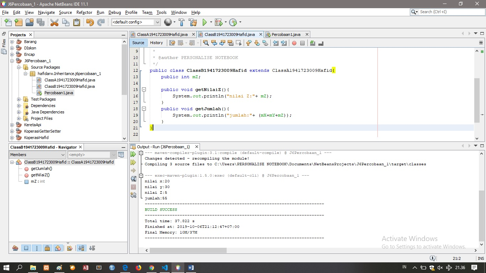

# Laporan Praktikum #6 - Inheritance

## Kompetensi

   1. Memahami konsep dasar inheritance atau	pewarisan.	
   2. Mampu	membuat suatu subclass dari suatu superclass tertentu.	
   3. Mampu mengimplementasikan konsep	single dan multilevel inheritance.
   4. Mampu	membuat objek dari suatu subclass dan melakukan	pengaksesan	terhadap	atribut dan	method baik	yang dimiliki       sendiri atau turunan	dari superclassnya.	
  

## Ringkasan Materi

(saya belum menemukan permasalahan khusus tapi saya sebagian memahami tentang java karena tugas ini)

## Percobaan

### Percobaan 1

#### A. Tahapan Percobaan

1. Percobaan pada source code ClassA1941723009Hafid.java

2. Percobaan pada source code ClassB1941723009Hafid.java 

3. Percobaan pada source code Percobaan1.java

4. Percobaan Program dijalankan

#### B. Pertanyaan

1. Pada percobaan 1 diatas program yang dijalankan terjadi error, kemudian perbaiki sehingga program tersebut bisa dijalankan dan tidak error!
Jawaban:

Percobaan pada source code ClassA1941723009Hafid.java

link kode program : [link kode](../../src/6_Inheritance/ClassA1941723009Hafid.java)

Percobaan pada source code ClassB1941723009Hafid.java 

link kode program : [link kode](../../src/6_Inheritance/ClassB1941723009Hafid.java)

Percobaan pada source code Percobaan1.java

link kode program : [link kode](../../src/6_Inheritance/Percobaan1.java)

2. Jelaskan apa penyebab program pada percobaan 1 ketika dijalankan terdapat error!
Jawaban:
Karena belum ada pendeklarasian ClassB subclass dari ClassA, harus menambahkan extends ClassA didalam ClassB.

### Percobaan 2

#### A. Tahapan Percobaan

1. Percobaan pada source code ClassA1941723009Hafid.java

2. Percobaan pada source code ClassB1941723009Hafid.java 

3. Percobaan pada source code Percobaan1.java

4. Percobaan Program dijalankan

#### B. Pertanyaan

1.	Pada percobaan 2 diatas program yang dijalankan terjadi error, kemudian perbaiki sehingga program tersebut bisa dijalankan dan tidak error!
Jawaban:

Percobaan pada source code ClassA1941723009Hafidp2.java

link kode program : [link kode](../../src/6_Inheritance/ClassA1941723009Hafidp2.java)

Percobaan pada source code ClassB1941723009Hafidp2.java 

link kode program : [link kode](../../src/6_Inheritance/ClassB1941723009Hafidp2.java)

Percobaan pada source code Percobaan2.java

link kode program : [link kode](../../src/6_Inheritance/Percobaan1.java)

2. Jelaskan apa penyebab program pada percobaan 1 ketika dijalankan terdapat error!
Jawaban:
belum ada pendeklarasian ClassB subclass dari ClassA, harus menambahkan public class ClassB extends ClassA. Dan access modifier dari x dan y diganti protected agar bisa diakses oleh subclassnya sendiri.

### Percobaan 3

#### A. Tahapan Percobaan

1. Percobaan pada source code Bangun1941723009Hafid.java

link kode program : [link kode](../../src/6_Inheritance/Bangun1941723009Hafid.java)

2. Percobaan pada source code Tabung1941723009Hafid.java 

link kode program : [link kode](../../src/6_Inheritance/Tabung1941723009Hafid.java)

3. Percobaan pada source code Percobaan3.java

link kode program : [link kode](../../src/6_Inheritance/percobaan3.java)

#### B. Pertanyaan

1. Jelaskan fungsi “super” pada potongan program berikut di class Tabung!

Jawaban:
berfungsi untuk memanggil atribut di dalam kelas induk

2.	Jelaskan fungsi “super” dan “this” pada potongan program berikut di class Tabung!

Jawaban:
Super memanggil atribut memilih class extendsnya, this menunjukkan atribut yang dimiliki class itu sendiri

3.	Jelaskan mengapa pada class Tabung tidak dideklarasikan atribut “phi” dan “r” tetapi class tersebut dapat mengakses atribut tersebut!
Jawaban:
Karena Class Tabung subclass dari class Bangun, phi dan r adalah atribut dari class Bangun yang memiliki acces modifier protected

### Percobaan 4

#### A. Tahapan Percobaan

1. Percobaan pada source code ClassA41941723009Hafid.java

link kode program : [link kode](../../src/6_Inheritance/ClassA41941723009Hafid.java)

2. Percobaan pada source code ClassB41941723009Hafid.java 

link kode program : [link kode](../../src/6_Inheritance/ClassB41941723009Hafid.java)

3. Percobaan pada source code ClassC41941723009Hafid.java 

link kode program : [link kode](../../src/6_Inheritance/ClassC41941723009Hafid.java)

4. Percobaan pada source code Percobaan4.java

link kode program : [link kode](../../src/6_Inheritance/percobaan4.java)

#### B. Pertanyaan

1.	Pada percobaan 4 sebutkan mana class yang termasuk superclass dan subclass, kemudian jelaskan alasannya!
Jawaban:
Superclass: ClassA4 dan ClassB4
Subclass: ClassB4 dan ClassC4
Karena ClassB4 mengextends dari class ClassA4 dan ClassC4 mengextends lagi ke class ClassB4

2.	Ubahlah isi konstruktor default ClassC seperti berikut:
  
Tambahkan kata super() di baris Pertaman dalam konstruktor defaultnya. Coba jalankan kembali class Percobaan4 dan terlihat tidak ada perbedaan dari hasil outputnya!
Jawaban:

3.	Ublah isi konstruktor default ClassC seperti berikut:

Ketika mengubah posisi super() dibaris kedua dalam kontruktor defaultnya dan terlihat ada error. Kemudian kembalikan super() kebaris pertama seperti sebelumnya, maka errornya akan hilang.
Perhatikan hasil keluaran ketika class Percobaan4 dijalankan. Kenapa bisa tampil output seperti berikut pada saat instansiasi objek test dari class ClassC
 
Jelaskan bagaimana urutan proses jalannya konstruktor saat objek test dibuat!
Jawaban:
ClassC4 dengan  menambakan super() berfungsi untuk memanggil konstruktor parent class /superclass, jika tidak dipanggil konstruktor class parent akan terpanggil.

4.	Apakah fungsi super() pada potongan program dibawah ini di ClassC!

Jawaban:
memanggil konstruktor parent class /superclass

### Percobaan 5
(Menyusul Pak Habibie)
#### A. Tahapan Percobaan
(Menyusul Pak Habibie)
#### B. Pertanyaan
(Menyusul Pak Habibie)
### Percobaan 6
(Menyusul Pak Habibie)
#### A. Tahapan Percobaan
(Menyusul Pak Habibie)
#### B. Pertanyaan
(Menyusul Pak Habibie)
## Tugas
(Menyusul Pak Habibie)
## Kesimpulan
(Menyusul Pak Habibie)
## Pernyataan Diri

Saya menyatakan isi tugas, kode program, dan laporan praktikum ini dibuat oleh saya sendiri. Saya tidak melakukan plagiasi, kecurangan, menyalin/menggandakan milik orang lain.

Jika saya melakukan plagiasi, kecurangan, atau melanggar hak kekayaan intelektual, saya siap untuk mendapat sanksi atau hukuman sesuai peraturan perundang-undangan yang berlaku.

Ttd,

HAFID ALI RAHMAN WIBISANA
