# Laporan #7 - Pengantar Konsep PBO

# Overloading & Overriding

## Kompetensi

Setelah menempuh pokok bahasan ini, mahasiswa mampu : 
1. Memahami konsep overloading dan overriding. 
2. Memahami perbedaan overloading dan overriding. 
3. Ketepatan dalam mengidentifikasi method overriding dan overloading.
4. Ketepatan dalam mempraktekkan instruksi pada jobsheet. 
5. Mengimplementasikan method overloading dan overriding.
  
## Ringkasan Materi

Overloading adalah suatu method yang mempunyai nama yang sama dan return yang boleh atau tidak sama tapi berbeda parameter artinya berbeda type data, Overloading dapat diakses ke semua class menurut kebutuhan
Overriding adalah suatu method yang mempunyai nama class yang sama dan parameeternya juga samabegitu juga returnnya juga sama, Overriding hanya dapat diakses di class inheritance saja 

## Percobaan

### Percobaan 1

1. Percobaan pada source code Karyawan

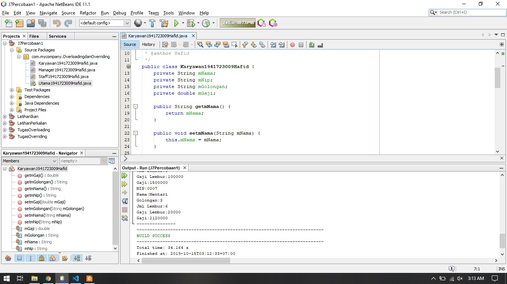

link kode program : [link kode](../../src/7_Overloading_dan_Overriding/Karyawan1941723009Hafid.java)

2. Percobaan pada source code Manager 

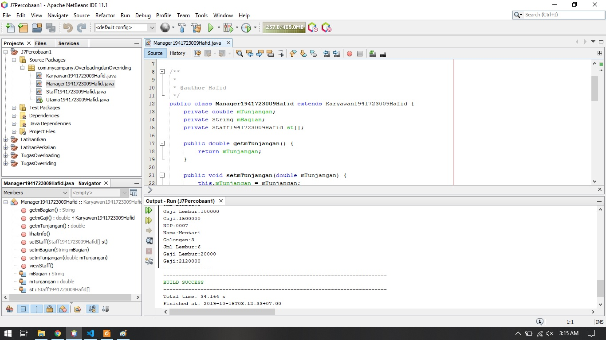

link kode program : [link kode](../../src/7_Overloading_dan_Overriding/Manager1941723009Hafid.java)

3. Percobaan pada source code staff

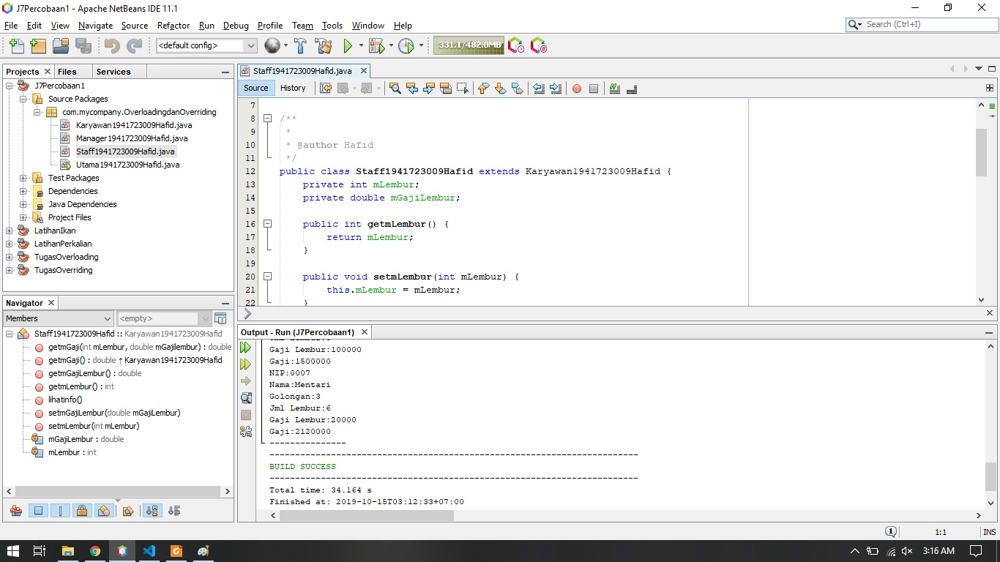

link kode program : [link kode](../../src/7_Overloading_dan_Overriding/Staff1941723009Hafid.java)

4. Percobaan Program dijalankan

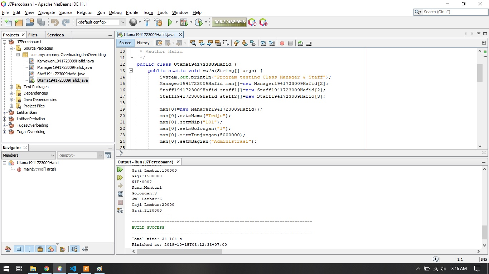

link kode program : [link kode](../../src/7_Overloading_dan_Overriding/Utama1941723009Hafid.java)

### Percobaan 2 (Latihan)

### PerkalianKu

1. latihan pada source code PerkalianKu

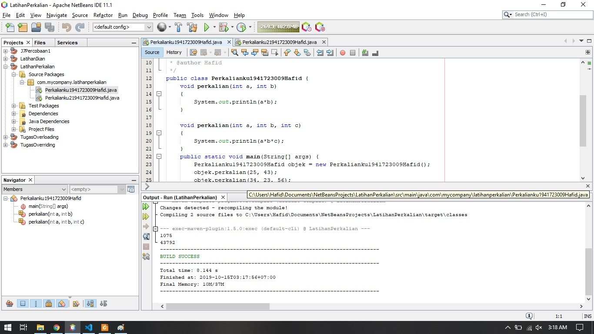

## Pertanyaan

1. Dari source coding diatas terletak dimanakah overloading
	Jawab:
	Berada di void perkalian yang berparameter(int a, int b) 

2. Jika terdapat overloading ada berapa jumlah parameter yang berbeda? 
	Jawab:
	Ada 2 parameter

link kode program : [link kode](../../src/7_Overloading_dan_Overriding/PerkalianKu1941723009Hafid.java)

### PerkalianKu2

2. latihan pada source code PerkalianKu2

## Pertanyaan

3.  Dari source coding diatas terletak dimanakah overloading? 
	Jawab:
	Berada di void yang berparameter(int a, int b) dan (double a, double b)

4. Jika terdapat overloading ada berapa tipe parameter yang berbeda? 
	Jawab:
	Ada dua tipe data yaitu int dan double
	
link kode program : [link kode](../../src/7_Overloading_dan_Overriding/PerkalianKu21941723009Hafid.java)

### Ikan

1. latihan pada source code Ikan

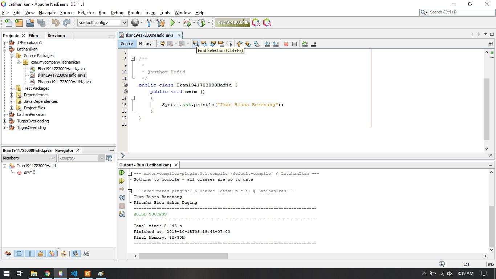

link kode program : [link kode](../../src/7_Overloading_dan_Overriding/Ikan1941723009Hafid.java)

2. latihan pada source code Piranha

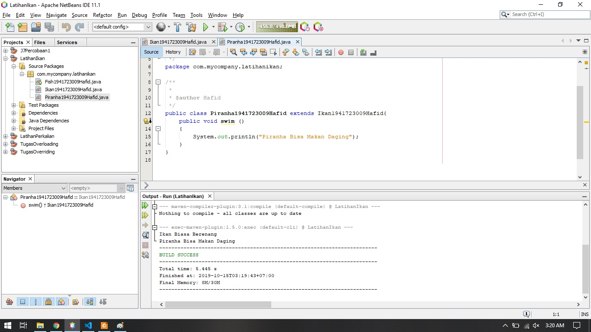

link kode program : [link kode](../../src/7_Overloading_dan_Overriding/Piranha1941723009Hafid.java)

3. latihan pada source code Fish

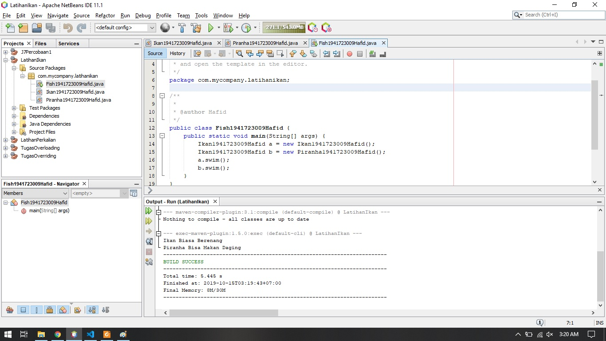

link kode program : [link kode](../../src/7_Overloading_dan_Overriding/Fish1941723009Hafid.java)

## Pertanyaan

5. Dari source coding diatas terletak dimanakah overriding? 
	Jawab:
	

6. Jabarkanlah apabila sourcoding diatas jika terdapat overriding?
	Jawab:
	Overriding Merupakan Suatu Keadaan Dimana kelas fish dan piranha dapat mengubah atau bisa kita bilang memodifikasi atau memperluas data dan method pada kelas ikan
 
link kode program : [link kode](../../src/7_Overloading_dan_Overriding/Ikan1941723009Hafid.java)

## Tugas

### Overloading Segitiga

1. latihan pada source code Segitiga

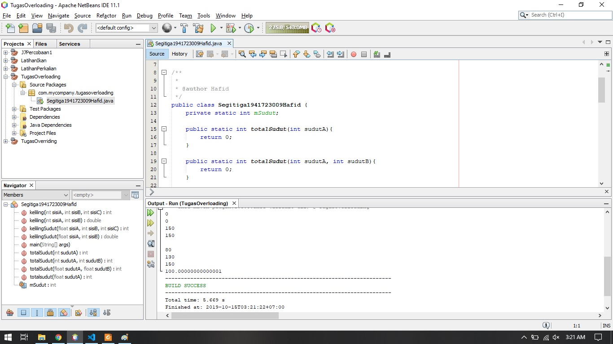

link kode program : [link kode](../../src/7_Overloading_dan_Overriding/Segitiga1941723009Hafid.java)

### Overriding Manusia

2. latihan pada source code Manusia

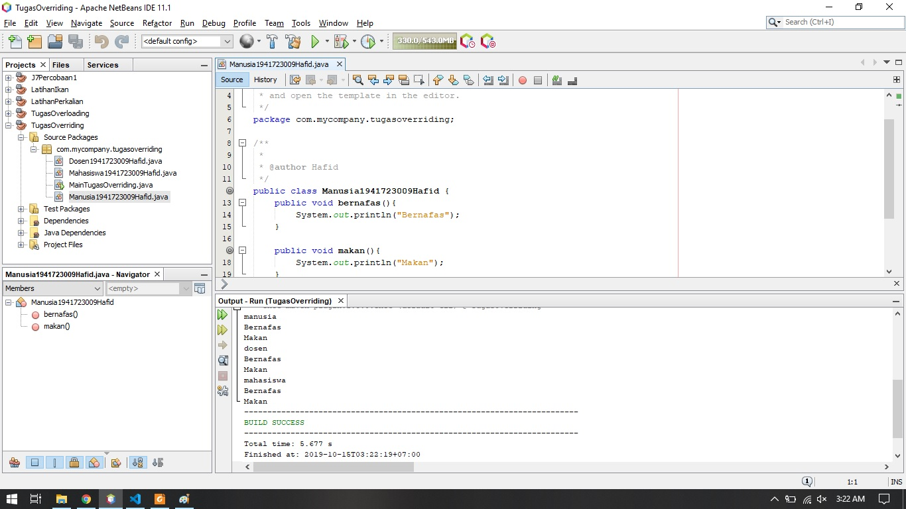

link kode program : [link kode](../../src/7_Overloading_dan_Overriding/Manusia1941723009Hafid.java)

3. latihan pada source code Dosen

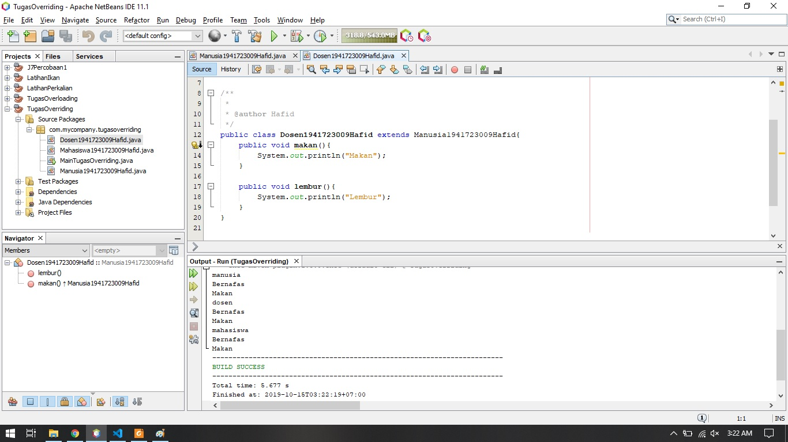

link kode program : [link kode](../../src/7_Overloading_dan_Overriding/Dosen1941723009Hafid.java)

4. latihan pada source code Mahasiswa

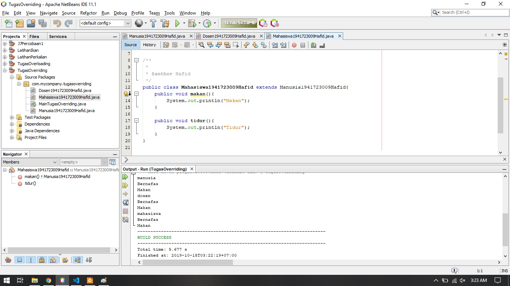

link kode program : [link kode](../../src/7_Overloading_dan_Overriding/Mahasiswa1941723009Hafid.java)

## Kesimpulan

Overloading adalah suatu method yang mempunyai nama yang sama dan return yang boleh atau tidak sama tapi berbeda parameter artinya berbeda type data, Overloading dapat diakses ke semua class menurut kebutuhan Overriding adalah suatu method yang mempunyai nama class yang sama dan parameeternya juga samabegitu juga returnnya juga sama, Overriding hanya dapat diakses di class inheritance saja
## Pernyataan Diri

	Saya menyatakan isi tugas, kode program, dan laporan praktikum ini dibuat oleh saya sendiri. Saya tidak melakukan plagiasi, kecurangan, menyalin/menggandakan milik orang lain.

	Jika saya melakukan plagiasi, kecurangan, atau melanggar hak kekayaan intelektual, saya siap untuk mendapat sanksi atau hukuman sesuai peraturan perundang-undangan yang berlaku.

	Ttd,

	(Hafid Ali Rahman Wibisana)