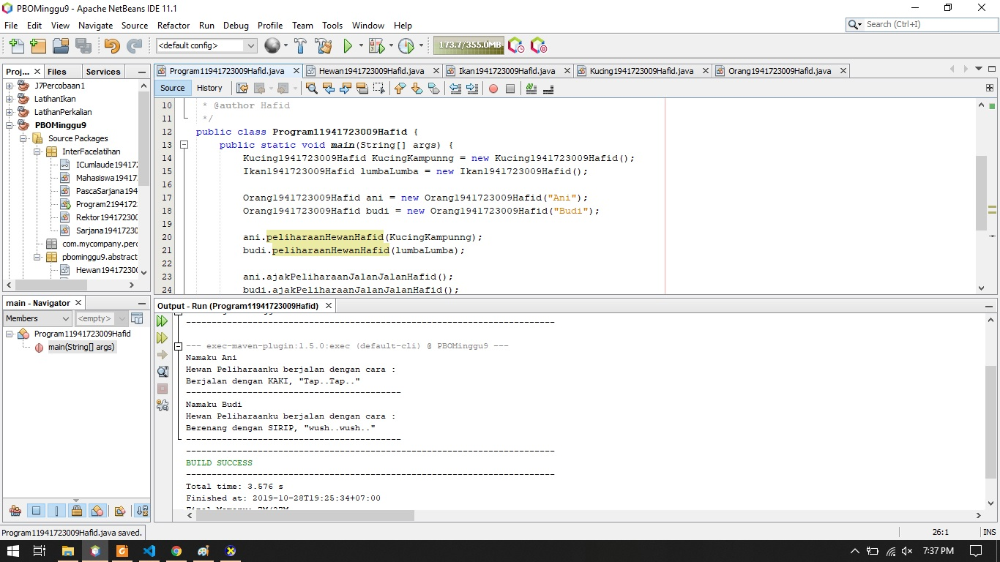
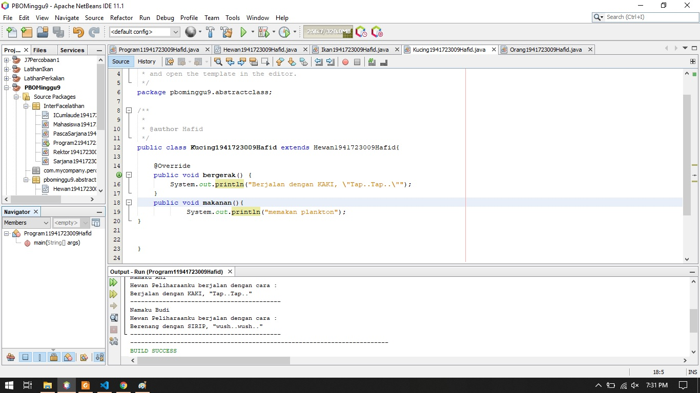
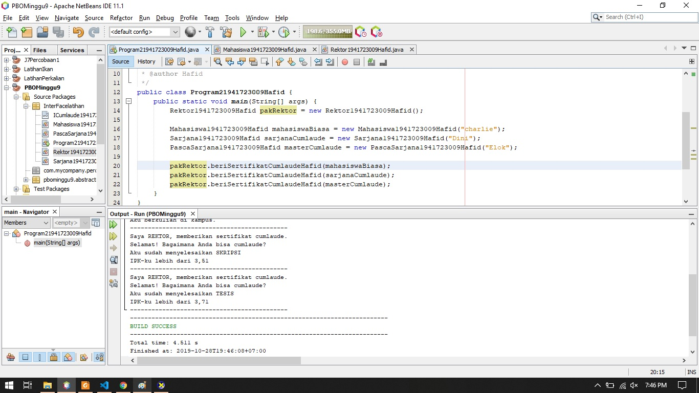
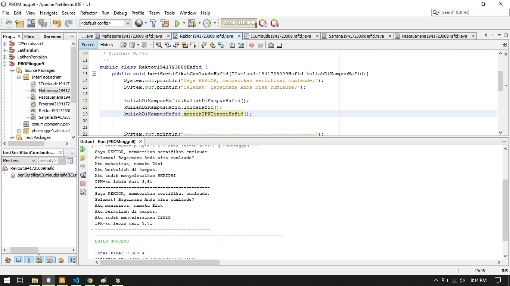
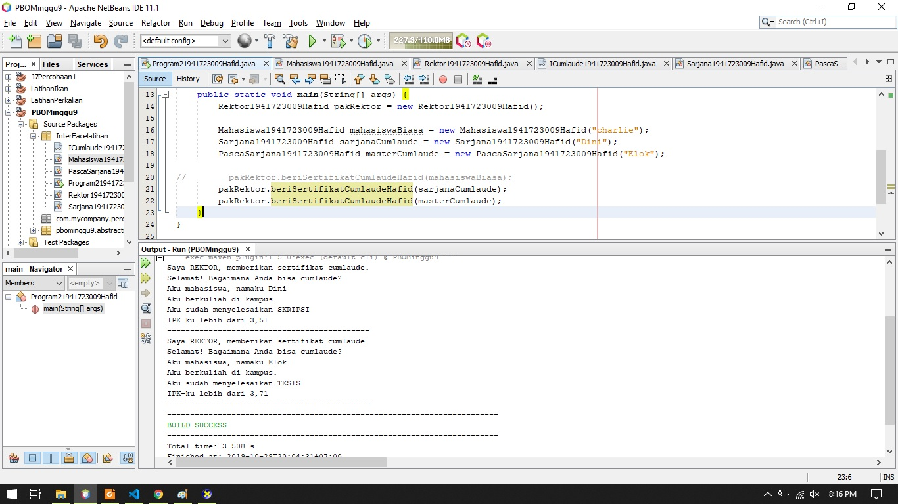
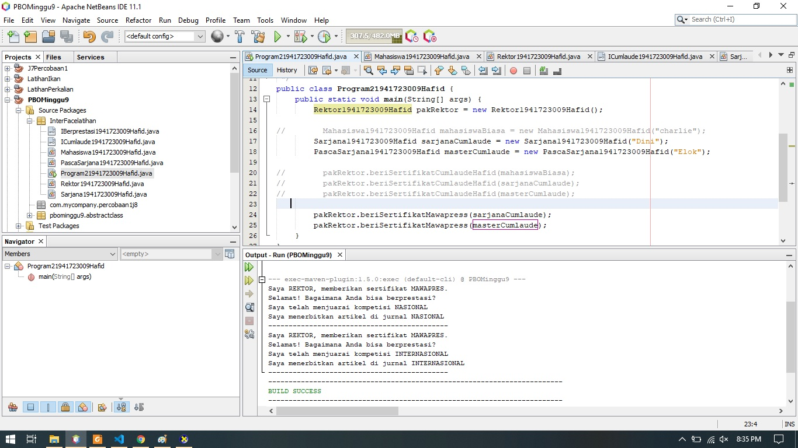

# Laporan #7 - Pengantar Konsep PBO

# Overloading & Overriding

## Kompetensi

Setelah menyelesaikan lembar kerja ini mahasiswa diarapkan mampu:
1. Menjelaskan maksud dan tujuan penggunaan Abstract Class
2. Menjelaskan maksud dan tujuan penggunaan Interface
3. Menggunakan Abstract Class dan Interface di dalam pembuatan program
  
## Ringkasan Materi

Abstract Class adalah Class yang tidak dapat diinstansiasi namun dapat di-extend.
Abstract class baru dapat dimanfaatkan ketia ia di-extend.
Karakteristik:
- Dapat memiliki properties dan methods seperti class biasa.
- Selalu memiliki methods yang tidak memiliki tubuh (hanya deklarasinya saja),
disebut juga abstract method.
- Selalu dideklarasikan dengan menggunakan keyword ‘abstract class’.
Interface adalah Struktur data yang hanya berisi abstract methods. Tidak ada apaapa selain method abstract pada interface, termasuk atribute getter dan setter.
Karakteristik:
- Tidak ada apa-apa di dalamnya selain abstract methods.
- Di konvensi bahasa pemrograman Java, namanya dianjurkan untuk selalu
diawali dengan huruf kapital ‘I’.
- Selalu dideklarasikan dengan menggunakan keyword ‘interface’.
- Diimplementasikan dengan menggunakan keyword ‘implements’

## Percobaan

### Percobaan 1

1. Percobaan pada main Abstract class

link kode program : [link kode](../../src/8_Abstract_Class_dan_Interface/Program11941723009Hafid.java)

### Pertanyaan diskusi
a. boleh sebuah class yang meng-extend suatu abstract class tidak mengimplementasikan method abstract yang ada di kelas induknya 

### Percobaan 2 

1. Percobaan pada main Interface

link kode program : [link kode](../../src/8_Abstract_Class_dan_Interface/Program21941723009Hafid.java)

### Pertanyaan diskusi

a. Karena class mahasiswa belum mengimplementasikan classnya ke class induk interface dan belum memenuhi syarat method yang terdapat di class induk, syarat method dari induk ke anaknya terdapat 1 method apabila ada satu akan terjadi eror maka jika tidak terjadi eror harus menambahkan semua method yang ada di class interface

b. bisa karena objectCumlaude pada class sarjana terdapat method yang diextends dari class mahasiswa dan diimplementasikan di class interfaceCumlaude atau induk

c. dapat karena terdapat method kuliahDiKampus disemua class biasa yang berimplementasikan ke class interface/induk

d. 

### Percobaan 3

1. Percobaan pada Multiple Interface Implementation

a. 

link kode program : [link kode](../../src/8_Abstract_Class_dan_Interface/Program21941723009Hafid.java)

## Kesimpulan

yang saya pelajari dari tugas jobsheet ke 8 adalah class interface dapat diimplementasikan oleh class biasa dan method yang terdapat di class biasa harus sama dengan method yang ada di class interface dan juga pada method class biasa kita bisa memberi method dari class induk ke dalam parameter method biasa
sehingga program dapat dijalankan 

## Pernyataan Diri

	Saya menyatakan isi tugas, kode program, dan laporan praktikum ini dibuat oleh saya sendiri. Saya tidak melakukan plagiasi, kecurangan, menyalin/menggandakan milik orang lain.

	Jika saya melakukan plagiasi, kecurangan, atau melanggar hak kekayaan intelektual, saya siap untuk mendapat sanksi atau hukuman sesuai peraturan perundang-undangan yang berlaku.

	Ttd,

	(Hafid Ali Rahman Wibisana)