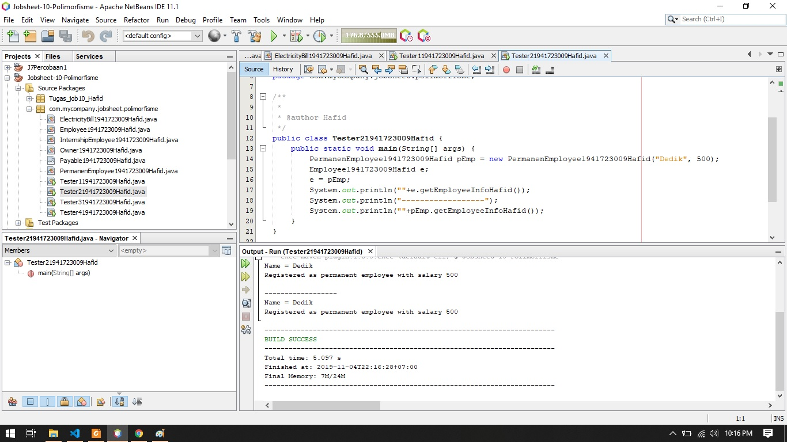

# Laporan #9 - Pengantar Konsep PBO

# Polimorfisme

## Kompetensi

Setelah melakukan percobaan pada jobsheet ini, diharapkan mahasiswa
mampu:

a. Memahami konsep dan bentuk dasar polimorfisme.

b. Memahami konsep virtual method invication.

c. Menerapkan polimorfisme pada pembuatan heterogeneous collection

d. Menerapkan polimorfisme pada parameter/argument method

e. Menerapkan object casting untuk meng-ubah bentuk objek
  
## Ringkasan Materi

Polimorfisme merupakan kemampuan suatu objek untuk memiliki banyak
bentuk. konsep polimorfisme bisa
diterapkan pada class-class yang memiliki relasi inheritance (relasi
generalisasi atau IS-A). Selain pada class-class yang memiliki relasi inheritance, polimorfisme
juga bisa diterapkan pada interface. Ketika ada objek yang dideklarasikan dari
suatu interface, maka ia bisa digunakan untuk mereferensi ke objek dari
class-class yang implements ke interface tersebut. Selain pada class-class yang memiliki relasi inheritance, polimorfisme
juga bisa diterapkan pada interface. Ketika ada objek yang dideklarasikan dari
suatu interface, maka ia bisa digunakan untuk mereferensi ke objek dari
class-class yang implements ke interface tersebut. Polimorfisme juga bisa diterapkan pada argument suatu method. Tujuannya
agar method tersebut bisa menerima nilai argument dari berbagai bentuk
objek. Operator instanceof bisa digunakan untuk mengecek apakah suatu objek
merupakan hasil instansiasi dari suatu class tertentu. Hasil dari instanceof
berupa nilai boolean. Casting objek digunakan untuk mengubah tipe dari suatu objek. Jika ada
suatu objek dari subclass kemudian tipenya diubah ke superclass, maka hal
ini termasuk ke upcasting.

## Percobaan

### Percobaan 1

1. Percobaan pada class Employee

link kode program : [link kode](../../src/9_Employee1941723009Hafid.java)

2. Percobaan pada interface Payable

link kode program : [link kode](../../src/9_IPayable1941723009Hafid.java)

3. Percobaan pada class InternshipEmployee

link kode program : [link kode](../../src/9_InternshipEmployee1941723009Hafid.java)

4. Percobaan pada class PermanentEmployee

link kode program : [link kode](../../src/9_PermanentEmployee1941723009Hafid.java)

5. Percobaan pada class ElectricityBill

link kode program : [link kode](../../src/9_ElectricityBill1941723009Hafid.java)

6. Percobaan pada class Tester1

link kode program : [link kode](../../src/9_Tester11941723009Hafid.java)

### Pertanyaan
1. Class apa sajakah yang merupakan turunan dari class Employee?
jawab :
Class InternshipEmployee dan Class PermanentEmployee
2. Class apa sajakah yang implements ke interface Payable?
jawab :
Class PermanentEmployee dan Class ElectricityBill
3. Perhatikan class Tester1, baris ke-10 dan 11. Mengapa e, bisa diisi
dengan objek pEmp (merupakan objek dari class PermanentEmployee) dan objek iEmp (merupakan objek dari class
InternshipEmploye) ? 
jawab :
Karena Class PermanenEmployee dan Class InternshipEmployee merupakan Subclass / Class turunan dari Class Employee
4. Perhatikan class Tester1, baris ke-12 dan 13. Mengapa p, bisa diisi
dengan objek pEmp (merupakan objek dari class PermanentEmployee) dan objek eBill (merupakan objek dari class ElectricityBill) ?
jawab :
Karena Class ElectricityBill dan Class PermanentEmployee Merupakan Implements dari Class Interface IPayable
5. Coba tambahkan sintaks:
p = iEmp;
e = eBill;
pada baris 14 dan 15 (baris terakhir dalam method main) ! Apa yang
menyebabkan error?
jawab : 
p = iEmp;
Karena Class Interface Payable tidak mengimplementasikan ke kelas InternshipEmployee
e = Bill;
Karena Class Employee hanya menurunkan 2 Class yaitu Class InternshipEmployee dan PermanentEmployee, ElectricityEmployee tidak termasuk Class turunan dari Employee

6. Ambil kesimpulan tentang konsep/bentuk dasar polimorfisme!
jawab : 
kesimpulannya adalah suatu objek dapat berubah bentuk dari class turunannya menjadi parentnya apabila class turunannya diextends / memiliki hubungan dengan class parentnya, begitu juga Class interface walaupun hanya terdapat method saja di dalamnya tetapi method itu bisa diimplementasikan ke kelas yang diimplementasi dan bisa digunakan untuk class implementasinya

### Percobaan 2 

1. Percobaan pada class Tester2

link kode program : [link kode](../../src/9_Tester21941723009Hafid.java)

### Pertanyaan

1. Perhatikan class Tester2 di atas, mengapa pemanggilan e.getEmployeeInfo() pada baris 8 dan pEmp.getEmployeeInfo() pada baris 10 menghasilkan hasil
sama?
jawab :
Karena pemanggilan method didalam Class employee terdapat method overriding yang sama dengan method Class turunannya akan tetapi hasil output akan menampilkan method yang berada di class turunannya
sedangkan pEmp.getEmployeeInfo() hasil outputnya akan mengikuti method yang ada di dalam classnya
2. Mengapa pemanggilan method e.getEmployeeInfo() disebut
sebagai pemanggilan method virtual (virtual method invication),
sedangkan pEmp.getEmployeeInfo() tidak?
jawab :
e.getEmployeeInfo Karena Class parent berubah menjadi Class yang diturunkannya sedangkan pEmp.getEmployeeInfo memanggil method dari Classnya sendiri
3. Jadi apakah yang dimaksud dari virtual method invocation? Mengapa
disebut virtual?
jawab : 
Virtual method invocation terjadi ketika ada pemanggilan overriding method
dari suatu objek polimorfisme. Disebut virtual karena antara method yang
dikenali oleh compiler dan method yang dijalankan oleh JVM berbeda. disebut virtual Karena merubah bentuk ke Class turunannya

### Percobaan 3

1. Percobaan pada class Tester3

link kode program : [link kode](../../src/9_Tester31941723009Hafid.java)

### Pertanyaan

1. Perhatikan array e pada baris ke-8, mengapa ia bisa diisi dengan objek-objek dengan tipe yang berbeda, yaitu objek pEmp (objek dari PermanentEmployee) dan objek iEmp (objek dari InternshipEmployee) ?
jawab : 
Karena Class Employee hanya mengextends 2 Class yaitu  Class permanentEmployee dan Class InternshipEmployee
2. Perhatikan juga baris ke-9, mengapa array p juga biisi dengan objek-objek dengan tipe yang berbeda, yaitu objek pEmp (objek dari PermanentEmployee) dan objek eBill (objek dari ElectricityBilling) ?
jawab :
Karena Class tersebut di implement dari Class Interface Payable
3. Perhatikan baris ke-10, mengapa terjadi error?
jawab :
Karena Di Class Parent Employee tidak mengextends ke Class ElectricityBill

### Percobaan 4

1. Percobaan pada class Owner

link kode program : [link kode](../../src/9_Owner1941723009Hafid.java)

2. Percobaan pada class Tester4

link kode program : [link kode](../../src/9_Tester41941723009Hafid.java)

3. Hasil Output

link kode program : [link kode](../../src/9_Tester41941723009Hafid.java)

### Pertanyaan

1. Perhatikan class Tester4 baris ke-7 dan baris ke-11, mengapa
pemanggilan ow.pay(eBill) dan ow.pay(pEmp) bisa dilakukan,
padahal jika diperhatikan method pay() yang ada di dalam class
Owner memiliki argument/parameter bertipe Payable? Jika
diperhatikan lebih detil eBill merupakan objek dariElectricityBill dan pEmp merupakan objek dari
PermanentEmployee?
jawab : 
diperlukan fungsi if dan instanceof untuk mengambil suatu nilai dari 2 Class yang berbeda
2. Jadi apakah tujuan membuat argument bertipe Payable pada method pay() yang ada di dalam class Owner?
jawab :
tujuannya adalah untuk membedakan subClass yang di extends dari Class parent
3. Coba pada baris terakhir method main() yang ada di dalam class Tester4 ditambahkan perintah ow.pay(iEmp); Mengapa terjadi error?
jawab :
Karena Class interface Payable bukan Parent dari Class InternshipEmployee 
4. Perhatikan class Owner, diperlukan untuk apakah sintaks p
instanceof ElectricityBill pada baris ke-6 ?
jawab :
sintaks tersebut untuk mengecek apakah Class ElectricityBill adalah Class turunannya / implementnya Class Interface Payable
5. Perhatikan kembali class Owner baris ke-7, untuk apakah casting
objek disana (ElectricityBill eb = (ElectricityBill) p)
diperlukan ? Mengapa objek p yang bertipe Payable harus di-casting
ke dalam objek eb yang bertipe ElectricityBill ?

Karena untuk mengecek instanceof parent dan subclassnya dengan cara menghubungkan class parent dan subclassnya sehingga class parent berubah menjadi subclassnya apabila berhasil di ganti maka hasil output dari subclassnya akan muncul.

### Tugas

1. Percobaan pada class maintugas

link kode program : [link kode](../../src/9_TesterTugas1941723009Hafid.java)

2. hasil Output

## Kesimpulan

saya mempelajari konsep PBO salah satu 4 pilar yaitu Polimorfisme yang berartikan perubahan bentuk maksutnya Class parent Berubah bentuk menjadi Class turunannya dengan cara membuat objek dan memanggil method didalam Class parent yang mengoverriding ke Class turunannya.

## Pernyataan Diri

	Saya menyatakan isi tugas, kode program, dan laporan praktikum ini dibuat oleh saya sendiri. Saya tidak melakukan plagiasi, kecurangan, menyalin/menggandakan milik orang lain.

	Jika saya melakukan plagiasi, kecurangan, atau melanggar hak kekayaan intelektual, saya siap untuk mendapat sanksi atau hukuman sesuai peraturan perundang-undangan yang berlaku.

	Ttd,

	(Hafid Ali Rahman Wibisana)